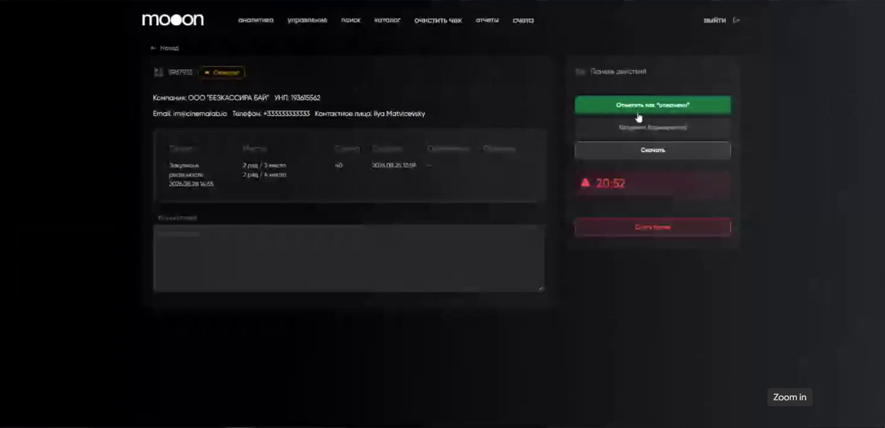

# Обработка счетов за бронирования билетов для юридических лиц

Инструкция для сотрудников, которые контролируют счета за резервы мест и отмечают подтверждённую оплату.

<strong>Для кого</strong>
Сотрудники с доступом к разделу Portal «Счета».

<strong>Когда применяется</strong>
Нужно найти созданный счёт, проверить данные брони, оставить внутренний комментарий или завершить оформление после оплаты.

<strong>Результат после отметки оплаты</strong>
Статус счёта меняется на «Оплачен», гостю уходят билеты на email, а в Manager автоматически появляется продажа.

## Где искать счёт

Откройте Portal → **«Счета»**. В разделе находятся автоматически созданные счета за бронирования юридических лиц.

Используйте фильтр по датам, сортировку или поиск. Поиск поддерживает номер счёта, название организации и email. Весь список счетов можно выгрузить в Excel.

## Что проверить в карточке счёта

1. Найдите нужный счёт и откройте его карточку.
2. Сверьте данные бронирования: организацию и УНП, email, телефон, контактное лицо, сеанс, ряд и места, сумму и срок действия брони.
3. При необходимости оставьте внутренний комментарий. Он сохраняется в карточке и виден другим сотрудникам.

## Как отметить подтверждённую оплату

Отмечайте счёт как оплаченный только после того, как у вас есть подтверждение поступления оплаты по этому счёту. Перед действием сопоставьте подтверждение оплаты с карточкой счёта: организацию, сумму и номер счёта.

1. Откройте карточку оплаченного счёта в Portal.
2. Нажмите **«Отметить как “оплачено”»**.
3. Проверьте, что в карточке статус изменился на **«Оплачен»**.

### Что система делает после отметки

- Отправляет билеты на email, который гость указал при оформлении брони.
- Создаёт в Manager транзакцию продажи. Создавать продажу вручную не требуется.
- Сохраняет продажу как обычную запись в таблице **«Продажи»** Manager.

## Как проверить продажу в Manager

1. Откройте Manager → **Меню → Общее → Продажи**.
2. Установите дату или период, соответствующие оплате.
3. Найдите созданную продажу по данным, которые есть в счёте: организации, сумме, сеансу или местам.
4. Откройте строку продажи двойным щелчком. В карточке проверьте основные параметры, детализацию билетов и оплату.

После отметки оплаты билетный резерв перестаёт быть только заявкой на счёт: в Portal он имеет статус «Оплачен», гость получает билеты, а операция участвует в учёте как продажа в Manager.

Подробнее о полях и поиске: [Проверка продаж в Manager](../Manager/Проверка%20продаж%20в%20Manager.md).

## Важно

!!! warning "Важно"
    Отметка оплаты запускает отправку билетов и создание продажи в Manager. Не нажимайте «Отметить как “оплачено”» до подтверждения оплаты именно этого счёта.

## Связанные страницы

- [Билеты и касса](../Продажа%20билетов.md)
- [Бронирование билетов для юридических лиц на mooon.by](Бронирование%20билетов%20для%20юридических%20лиц%20на%20mooon.by.md)
- [Проверка продаж в Manager](../Manager/Проверка%20продаж%20в%20Manager.md)
