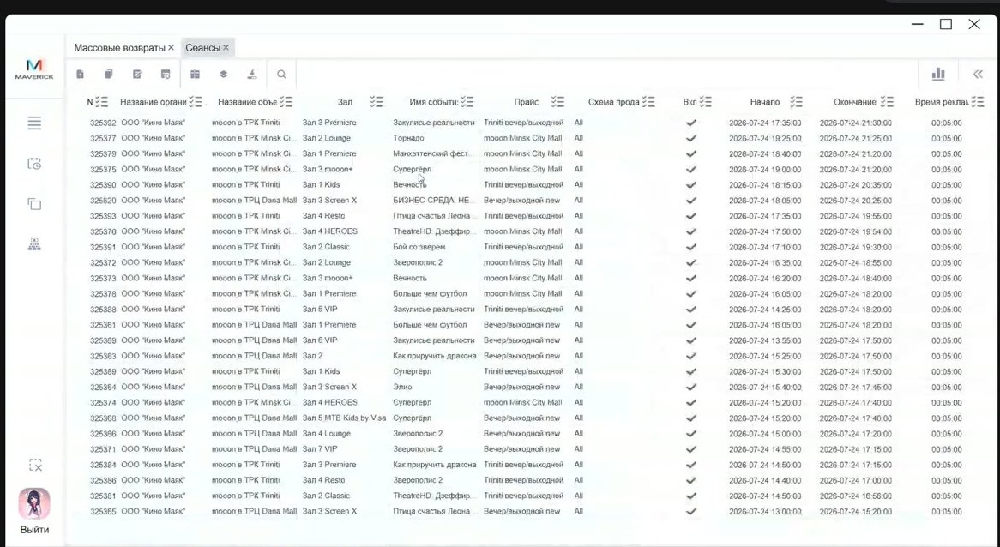
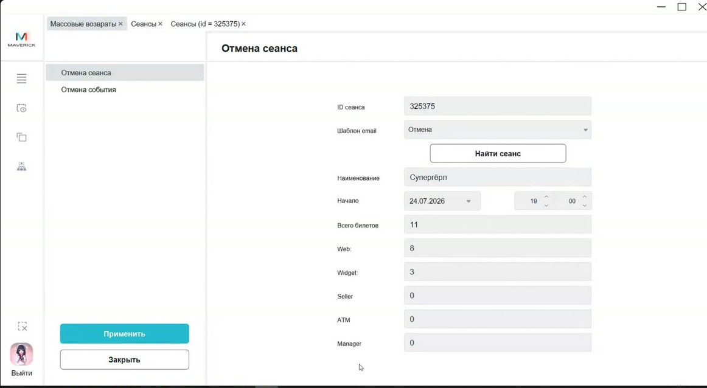
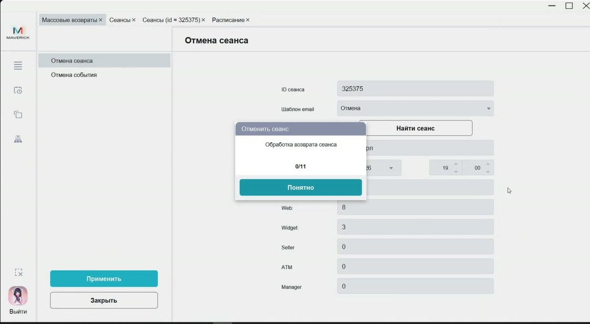
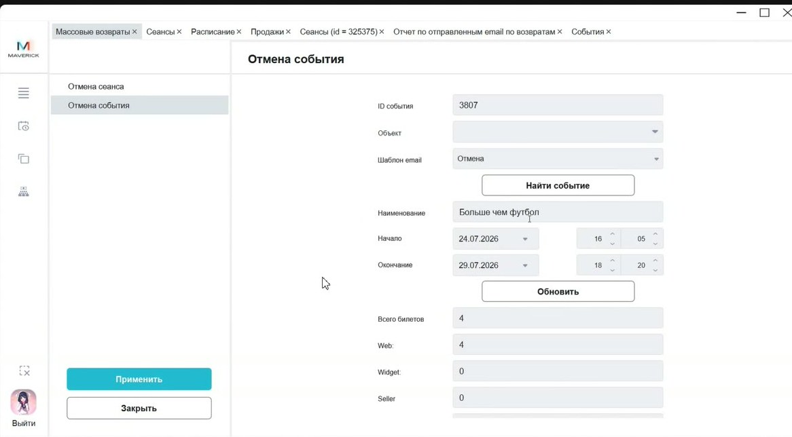
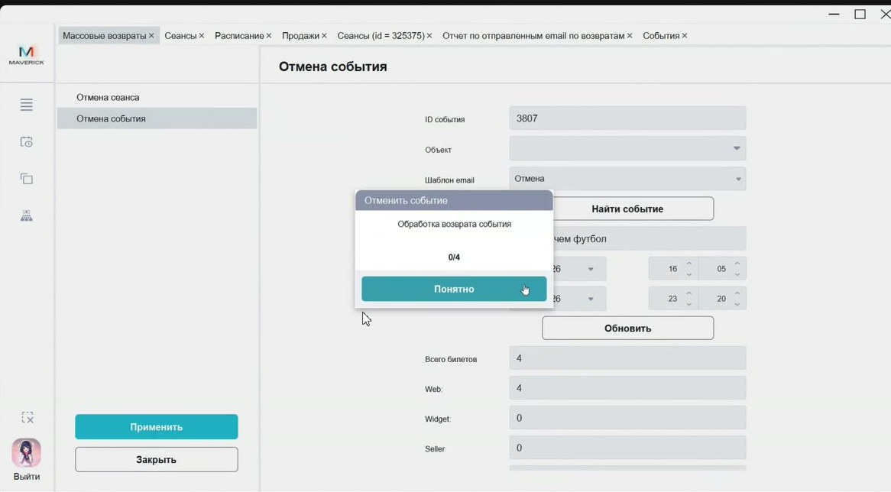
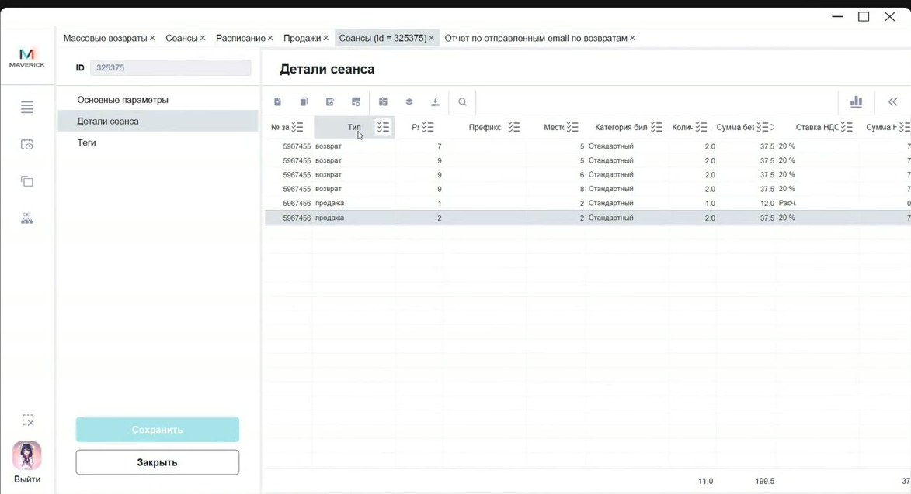

# Массовая отмена сеансов и событий в Manager

Инструкция помогает отменить оплаченные интернет-билеты на один сеанс или на сеансы одного события, отправить гостям уведомления и проверить, что возвраты и отмена расписания обработаны.

<strong>Для кого</strong>
Репертуарный отдел, специалист по расписанию, поддержка, администратор кассовой зоны.

<strong>Когда применяется</strong>
Когда кинотеатр отменяет сеанс или событие из-за форс-мажора, технической проблемы, недоступности зала, изменения проката или другого подтверждённого решения.

<strong>Что получится</strong>
По выбранным интернет-продажам создаются возвраты, гостям отправляются уведомления, а отменённые сеансы снимаются с публикации в расписании.

## Где находится

В Manager открой на левой панели **Массовые возвраты**.

Внутри доступны две вкладки:

- **Отмена сеанса** — для одного конкретного сеанса по ID;
- **Отмена события** — для сеансов одного события, при необходимости с фильтром по объекту и периоду.

## Перед началом

- Убедись, что решение об отмене сеанса или события подтверждено владельцем процесса.
- Определи, что нужно отменить: один сеанс или все сеансы события за период.
- Для отмены одного сеанса найди ID в таблице **Сеансы** и проверь объект, зал, событие, время начала, схему продаж и признак `Вкл`.
- Для отмены события найди ID события в справочнике **События**.
- Проверь, какие билеты проданы по каналам `Web`, `Widget`, `Seller`, `ATM`, `Manager`.
- Для массового возврата интернет-продаж используй утверждённый шаблон email. Для этой операции подтверждён шаблон `Отмена`; другие шаблоны применяй только по регламенту.
- До применения возврата сними затронутые сеансы с публикации в **Расписании**.

## Отменить один сеанс

1. Открой таблицу **Сеансы**.
2. Найди нужный сеанс и скопируй его ID.
3. Открой **Массовые возвраты → Отмена сеанса**.
4. Введи ID сеанса.
5. Выбери шаблон email.
6. Нажми **Найти сеанс**.
7. Проверь найденные данные: наименование, дату и время начала, общее количество билетов и разбивку по каналам продаж.

8. Открой **Расписание** и сними этот сеанс с публикации.
9. Вернись в **Массовые возвраты**.
10. Нажми **Применить** и подтверди действие.
11. Дождись обработки в окне **Отменить сеанс**.
12. После обработки проверь результат в Manager.

## Отменить событие

1. Открой **События** и найди ID нужного события.
2. Открой **Массовые возвраты → Отмена события**.
3. Введи ID события.
4. Если отмена относится только к отдельным площадкам, выбери объект или несколько объектов.
5. Выбери шаблон email.
6. Нажми **Найти событие**.
7. Проверь найденное событие, период начала и окончания, общее количество билетов и разбивку по каналам продаж.
8. Если нужно отменить только часть периода, измени даты и время начала/окончания и нажми **Обновить**.
9. Открой **Расписание** и сними с публикации все затронутые сеансы во всех выбранных объектах и датах.
10. Вернись в **Массовые возвраты**.
11. Нажми **Применить** и подтверди действие.
12. Дождись обработки в окне **Отменить событие**.

## Проверка результата

После обработки проверь:

- в окне обработки счётчик дошёл до конца или результат сверяется через таблицы Manager;
- в карточке сеанса на вкладке **Детали сеанса** появились строки с типом `возврат`;
- в деталях сеанса не осталось строк `продажа`, которые должны были быть отменены;
- в отчёте **Отчет по отправленным email по возвратам** есть записи по уведомлениям и понятен статус отправки;
- в таблице **Продажи** появились связанные возвраты;
- сеанс снят с публикации в **Расписании**;
- после обновления каналов продаж отменённый сеанс не продаётся на сайте, в виджете или другом затронутом канале.

## Важно

!!! warning "Операция связана с деньгами"
    Массовая отмена создаёт возвраты и уведомляет гостей. Не запускай операцию без подтверждённого решения, проверки ID, объекта, даты, времени, каналов продаж и снятия сеанса с публикации.

!!! warning "Проверь неуспешные возвраты"
    Если часть билетов не перешла в тип `возврат`, не запускай операцию повторно вслепую. Сначала проверь детали сеанса, продажи, отчёт по email и действующий регламент обработки ошибок.

!!! warning "Кассовые продажи требуют отдельного порядка"
    Массовая обработка подтверждена для интернет-продаж. Билеты из `Seller`, `ATM`, `Manager` или кассового процесса нужно обрабатывать по отдельному подтверждённому регламенту.

## Частые ошибки

- Отменяют возвраты, но оставляют сеанс опубликованным в расписании.
- Вводят ID события вместо ID сеанса или наоборот.
- При отмене события не проверяют объект и период, из-за чего в выборку попадают лишние сеансы.
- Не смотрят разбивку по каналам продаж и ожидают, что кассовые билеты обработаются так же, как интернет-продажи.
- Закрывают окно обработки и не проверяют, все ли продажи перешли в возвраты.
- Не проверяют статус отправки email после отмены.

## Связанные страницы

- [Расписание и события](../Расписание%20и%20события.md)
- [Планировщик расписания в Manager](Планировщик%20расписания%20в%20Manager.md)
- [Возврат билетов](../Продажа%20билетов/Возврат%20билетов.md)
- [Проверка продаж в Manager](../Manager/Проверка%20продаж%20в%20Manager.md)
- [События в Manager](../Manager/События%20в%20Manager.md)
