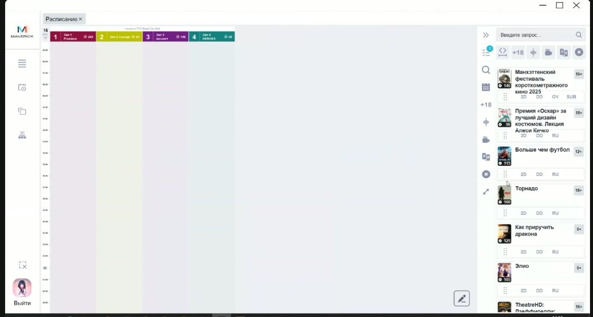
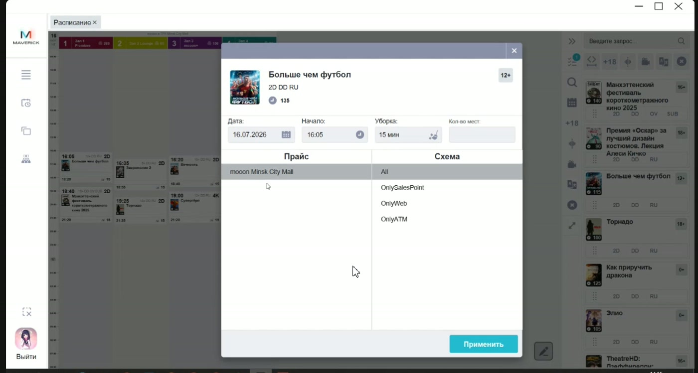
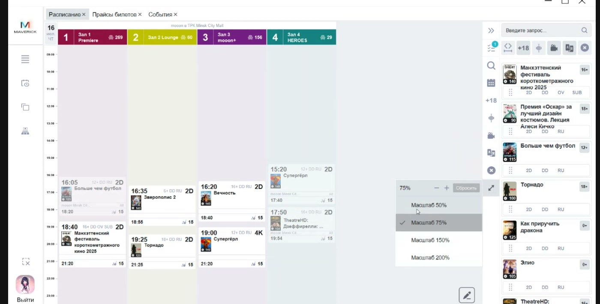
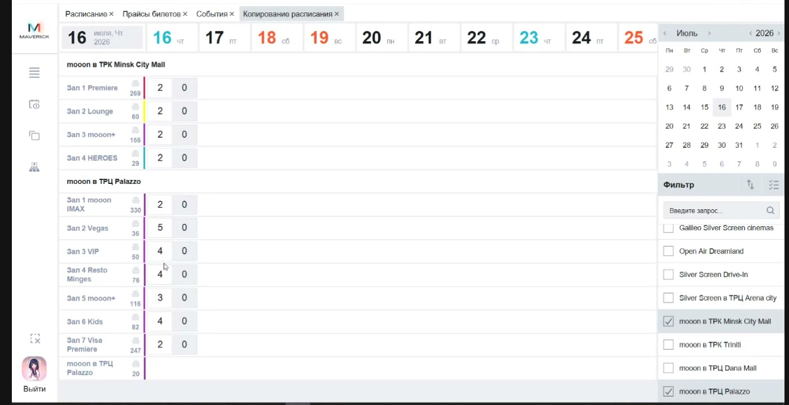

# Планировщик расписания в Manager

Инструкция помогает поставить сеансы в расписание кинотеатра, назначить прайс и схему продаж, опубликовать сеансы и скопировать готовую сетку на другие дни.

<strong>Для кого</strong>
Репертуарный отдел, специалист по расписанию, поддержка.

<strong>Когда применяется</strong>
Когда нужно составить расписание по объектам и залам, подготовить сеансы к продаже или перенести сетку расписания на следующие дни.

<strong>Что получится</strong>
В выбранных залах стоят сеансы на нужное время, у сеансов выбран прайс, задана схема продаж и выполнена публикация.

## Где находится

В Manager используй кнопки на левой панели:

- **Расписание** — для ручной расстановки и настройки сеансов;
- **Копирование расписаний** — для переноса готовой сетки на другие даты.

## Перед началом

- Событие должно быть заведено в справочнике **События**. В расписание подтягиваются события, у которых выбранная дата попадает в период показа.
- Форматы события задаются в карточке события: видеоформат, аудиоформат и язык. Если у события есть несколько форматов, в панели расписания будет несколько вариантов карточки.
- Для объекта должен быть подготовлен прайс билетов, который можно назначить сеансу.
- Перед публикацией нужно понимать схему продаж: она определяет, где будет доступен сеанс.

## Поставить сеанс в расписание

1. Открой **Расписание**.
2. Выбери один или несколько объектов.
3. Проверь, что после выбора объекта появились его залы и временная шкала.
4. При необходимости измени масштаб, чтобы видеть больше времени и карточек на экране.
5. Разверни правую панель событий.
6. Найди нужное событие через поиск или фильтры по возрасту, аудио, видеоформату и языку.
7. Выбери нужный вариант формата у события.
8. Перетащи карточку события мышкой в нужный зал и на нужное время.
9. Повтори действие для остальных сеансов.

На этом этапе карточки только расставлены в сетке. Чтобы сеанс появился в каналах продаж, нужно назначить прайс, выбрать схему продаж и опубликовать сеанс.

## Настроить карточку сеанса

1. Наведи курсор на карточку сеанса.
2. Открой редактирование через значок карандаша.
3. Проверь дату, время начала, время окончания и время на уборку.
4. Выбери прайс для объекта.
5. Выбери схему продаж:
   - `All` — все каналы продаж;
   - `OnlySalesPoint` — только касса;
   - `OnlyWeb` — только сайт;
   - `OnlyATM` — только киоск.
6. Нажми **Применить**.
7. Проверь, что выбранный прайс появился на карточке сеанса.
8. Опубликуй сеанс через галочку на карточке.

Опубликованная карточка становится визуально менее яркой. Неопубликованную карточку можно редактировать до публикации.

## Использовать фильтры и массовые действия

В планировщике есть два набора фильтров:

- фильтры над правой панелью событий — помогают найти событие для постановки в сетку;
- фильтры рядом с расписанием — помогают отобрать уже поставленные сеансы в таблице расписания.

Фильтровать можно по возрастному ограничению, аудиоформату, видеоформату и языку. Крестик сбрасывает выбранный фильтр.

Если нужно назначить один прайс сразу нескольким сеансам:

1. Отфильтруй нужные сеансы.
2. Нажми значок карандаша для массового действия.
3. Выбери прайс.
4. Нажми **Применить**.
5. Проверь выбранные карточки и опубликуй их.

## Скопировать расписание на другой день

Копирование удобно, когда сетка расписания повторяется несколько дней или всю неделю с небольшими изменениями.

1. Открой **Копирование расписаний** на левой панели.
2. Выбери один или несколько объектов.
3. Найди дату, с которой нужно копировать расписание.
4. Нажми правой кнопкой по нужной дате или ячейке дня.
5. Выбери действие копирования.
6. Перенеси выделенное расписание на нужную дату и нажми левую кнопку мыши.
7. Вернись в **Расписание** на дату, куда скопированы сеансы.
8. Назначь прайс скопированным сеансам.
9. Сделай сеансы активными и опубликуй их.
10. При необходимости вручную подвинь отдельные сеансы, добавь паузы или поставь дополнительные карточки.

При копировании переносятся карточки сеансов, но не переносится выбранный прайс. Пока прайс не назначен заново, скопированные сеансы остаются неактивными.

## Проверка результата

После настройки проверь:

- открыт правильный объект и правильная дата;
- сеанс стоит в нужном зале и на нужное время;
- дата, время начала, время окончания и уборка указаны корректно;
- выбран нужный прайс;
- схема продаж соответствует нужным каналам;
- сеанс опубликован;
- после обновления каналов продаж сеанс появился там, где должен продаваться: на сайте, в кассе или в киоске;
- после копирования на новую дату прайс назначен заново, а сеансы сделаны активными.

## Важно

!!! warning "Сеансы видят клиенты и касса"
    Ошибка в расписании, прайсе или схеме продаж может опубликовать сеанс не в том канале, не на то время или без нужных условий продажи. Не публикуй сеанс, пока не проверены событие, дата, зал, прайс и схема продаж.

!!! warning "Копирование не переносит прайс"
    После копирования расписания обязательно назначь прайс скопированным сеансам заново. Без прайса такие карточки не становятся активными.

## Частые ошибки

- Перетащили событие в сетку, но не назначили прайс и не опубликовали сеанс.
- Скопировали расписание на следующий день и забыли назначить прайс заново.
- Выбрали не тот формат события: например, другой видеоформат, аудиоформат или язык.
- Поставили правильный сеанс, но выбрали неверную схему продаж.
- Ищут событие в правой панели на дату, которая не входит в период показа события.
- Проверяют только сетку расписания, но не смотрят, появился ли сеанс в нужном канале продаж.

## Связанные страницы

- [Расписание и события](../Расписание%20и%20события.md)
- [События в Manager](../Manager/События%20в%20Manager.md)
- [Схемы продаж в Manager](../Manager/Схемы%20продаж%20в%20Manager.md)
- [Сортировка афиши](../Афиша%20и%20витрина/Сортировка%20афиши.md)
