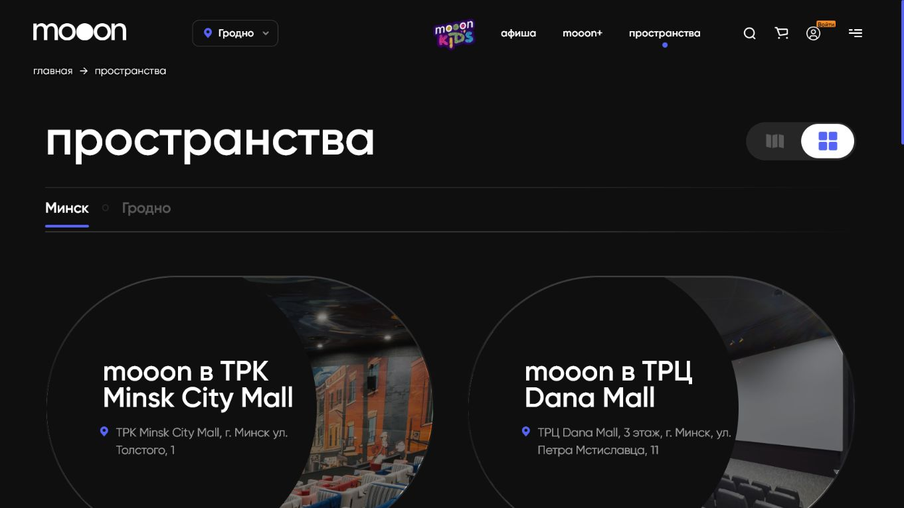

# mooon+ и пространства

Эта страница объясняет два крупных раздела сайта, которые часто путают с обычной афишей.

<strong>Для кого</strong>
Новый сотрудник и сотрудник поддержки гостя.

<strong>Когда применяется</strong>
Когда посетитель спрашивает про спецсобытия, площадки, адреса или формат зала.

<strong>Что получится</strong>
Сотрудник понимает, куда направить посетителя.

## mooon+

`mooon+` — это раздел для событий, которые шире обычного кинопроката.

На странице есть направления:

- `Театр`;
- `Лекции`;
- `Просмотр с экспертом`;
- `Документальное кино`;
- `Музыка`;
- `Спорт`;
- отдельные промо-события.

Кнопки `Подробнее` ведут на страницы направлений или конкретных событий. Если событие продаётся через афишу, дальше путь такой же: событие → сеанс → место → корзина → оплата.

## Пространства

`Пространства` — раздел про кинопространства сети.

На странице есть:

- переключение города;
- карточки пространств;
- адреса;
- описание залов и форматов.

Подтверждённые площадки из страницы и футера:

- `mooon в ТРК Minsk City Mall`;
- `mooon в ТРЦ Dana Mall`;
- `mooon в ТРЦ Palazzo`;
- `mooon в ТРК Triniti`;
- `Silver Screen в ТРЦ Arena City`.

## Как объяснять сотруднику

- `афиша` отвечает на вопрос "что и когда идёт".
- `mooon+` отвечает на вопрос "какие есть необычные события".
- `пространства` отвечает на вопрос "где находится кинотеатр и какие там залы".
- Если посетитель хочет купить билет, всё равно возвращаем его к афише или карточке события.

## Связанные страницы

- [Сайт mooon.by](../Сайт%20mooon.by.md)
- [Карта разделов сайта](Карта%20разделов%20сайта.md)
- [Афиша и покупка билета](Афиша%20и%20покупка%20билета.md)

