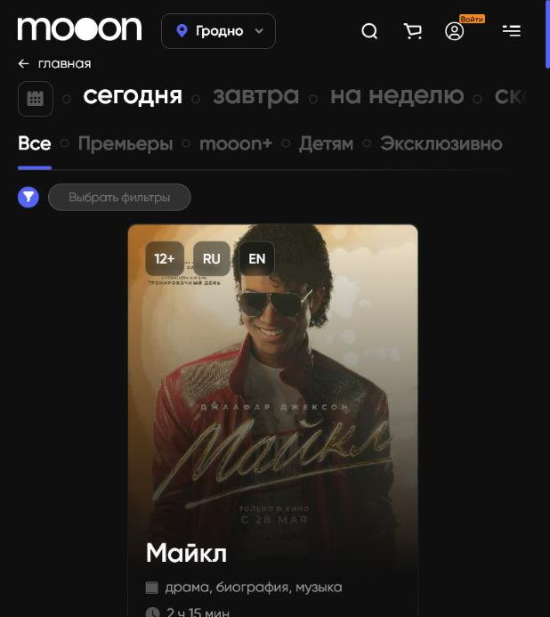
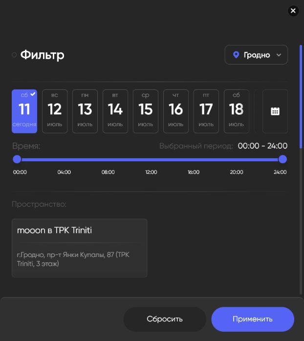
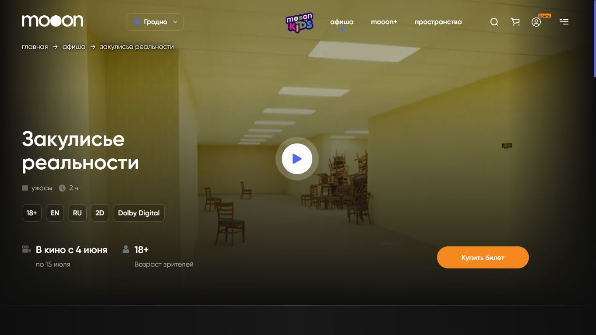
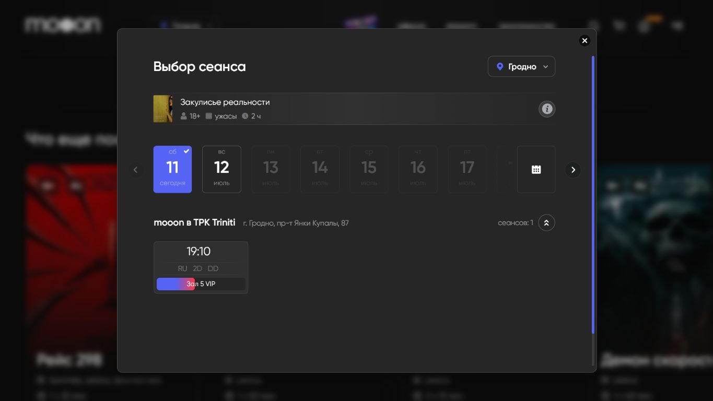
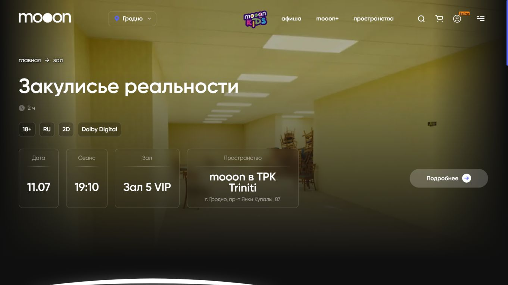
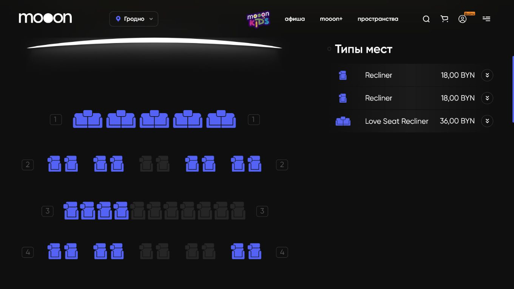
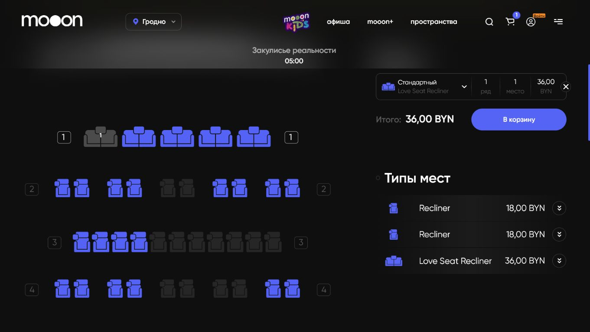
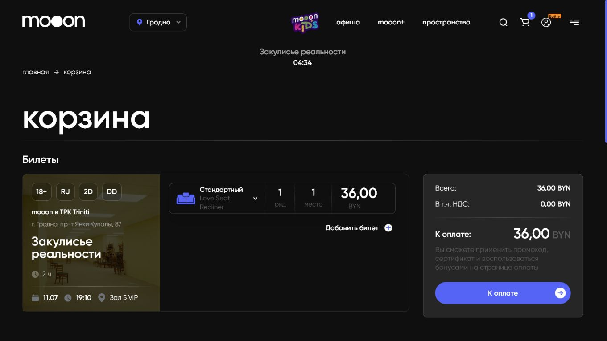
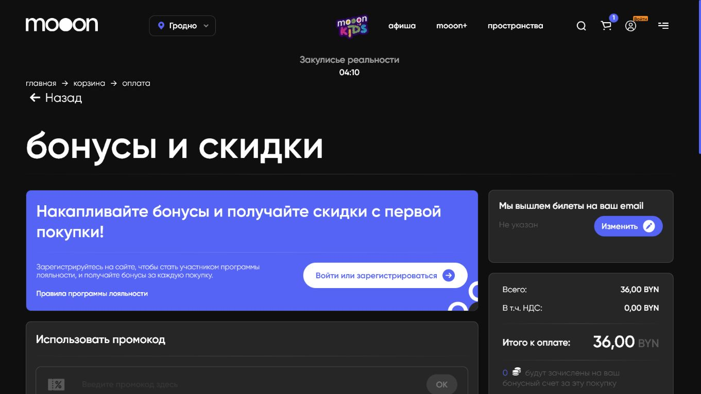
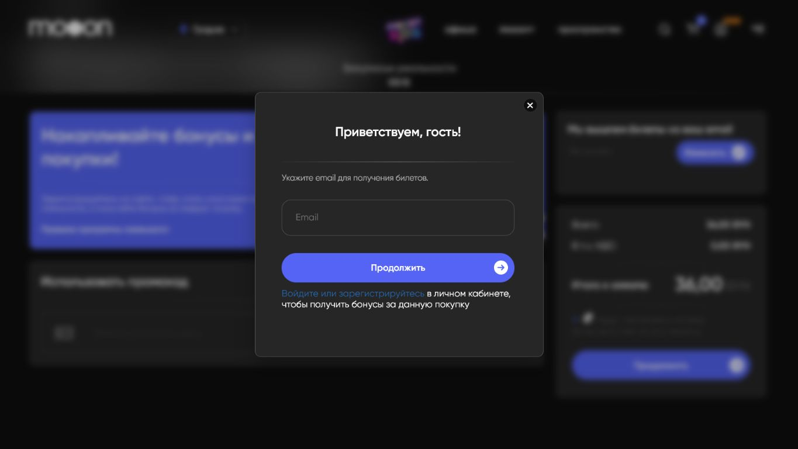

# Афиша и покупка билета

Эта страница описывает пользовательский путь на `mooon.by` от афиши до шага оплаты. Сценарий зафиксирован без входа в личный кабинет и без ввода персональных или платёжных данных.

## Общая схема

Путь покупки на сайте выглядит так:

1. Афиша выбранного города.
2. Карточка фильма или события.
3. Выбор сеанса.
4. Схема зала и выбор места.
5. Корзина.
6. Шаг оплаты.
7. Запрос email перед дальнейшим переходом.

Переход к платёжной системе BePaid не был зафиксирован, потому что сайт требует email перед продолжением.

## Афиша

Раздел `афиша` показывает фильмы и события для выбранного города. В примере использован город `Гродно`, потому что на момент разбора там были доступны сеансы.

На странице афиши есть:

- переключатель периода: `сегодня`, `завтра`, `на неделю`, `скоро`;
- тематические фильтры: `Все`, `Премьеры`, `mooon+`, `Детям`, `Эксклюзивно`;
- кнопка `Выбрать фильтры`;
- карточки фильмов и событий;
- возрастное ограничение;
- язык и формат;
- кнопки `Купить билет` и `Подробнее`.

## Фильтры афиши

Кнопка `Выбрать фильтры` открывает окно фильтрации.

В фильтре доступны параметры:

- город;
- дата или период;
- время;
- кинопространство.

Фильтр сужает список событий и сеансов на странице афиши.

## Карточка события

Карточка события открывается через `Подробнее` или через сценарий покупки.

На карточке отображаются:

- название;
- жанр;
- длительность;
- возрастное ограничение;
- язык;
- формат;
- период проката;
- описание события;
- кнопка `Купить билет`.

## Выбор сеанса

Кнопка `Купить билет` открывает окно `Выбор сеанса`.

В окне показаны:

- город;
- название события;
- дата;
- площадка;
- адрес;
- время сеанса;
- язык;
- формат;
- зал.

В зафиксированном примере выбран сеанс `19:10`, `RU`, `2D`, `DD`, `Зал 5 VIP`.

## Страница зала

После выбора сеанса открывается страница зала.

В верхней части страницы отображаются:

- фильм или событие;
- дата и время;
- зал;
- кинопространство;
- адрес;
- правила онлайн-продажи.

Ниже расположена схема мест.

На схеме есть легенда:

- `Свободно`;
- `Занято`;
- типы мест и ценовые категории, если они применяются к залу.

## Выбор места

После выбора свободного места появляется блок `Билеты`.

В блоке билета отображаются:

- тип билета;
- тип места;
- ряд;
- место;
- цена;
- итоговая сумма;
- кнопка `В корзину`.

## Корзина

Кнопка `В корзину` открывает корзину покупки.

В корзине отображаются:

- название фильма или события;
- площадка и адрес;
- дата и время;
- зал;
- ряд и место;
- стоимость билета;
- НДС;
- итог к оплате.

Кнопка `Добавить билет` возвращает к выбору мест. Кнопка `К оплате` открывает следующий шаг покупки.

## Шаг оплаты

На шаге оплаты сайт показывает параметры перед продолжением.

На странице есть:

- блок бонусов и скидок;
- вход или регистрация в личный кабинет;
- поле промокода;
- email для отправки билетов;
- итоговая сумма;
- НДС;
- кнопка `Продолжить`.

Если email не указан, после нажатия `Продолжить` появляется окно с просьбой указать email.

Без email дальнейший переход к оплате не открывается.

## Бонусы, промокод и скидки

На шаге оплаты блок `Бонусы и скидки` связывает покупку с личным кабинетом, бонусами и промокодом.

Что важно для базы знаний:

- бонусы лояльности используются после входа или регистрации;
- промокод вводится в поле `Использовать промокод`;
- после ввода промокода пользователь нажимает `ок`;
- сайт применяет промокод только если он подходит к выбранным билетам, местам и условиям акции;
- если промокод не подходит, сайт показывает ошибку.

Конкретные условия промокода, правила бонусов и ограничения по скидкам относятся к финансовым и договорным правилам. Их нельзя выводить из названия акции или пользовательского ожидания.

## Если билет не пришёл

Для восстановления билета есть отдельная страница `скачать билет`. Она запрашивает:

- номер заказа из подтверждения оплаты;
- email, указанный при покупке.

Если форма не находит билет, безопасный маршрут для гостя — обратиться в кассу до начала сеанса с подтверждением оплаты и номером заказа.

## Ограничения по билетам и местам

FAQ сайта добавляет несколько правил, которые влияют на консультацию по покупке:

- предварительное бронирование с последующей оплатой в кассе не описано как доступный сценарий;
- обмен билета на другой сеанс или другое место не выполняется как отдельная операция;
- если нужен другой сеанс или место, маршрут строится через возврат исходного билета и новую покупку;
- часть типов мест рассчитана на двух гостей, поэтому цена относится к месту соответствующего типа;
- для событий с категорией `16+` сайт отдельно указывает, что лица младше 16 лет не допускаются даже в сопровождении взрослых.

## Граница зафиксированного сценария

В текущем разборе сценарий остановлен на окне запроса email. Дальнейший шаг до BePaid требует согласованного тестового email и отдельного правила тестовой покупки.

В рамках этой страницы не выполняются:

- вход в личный кабинет;
- ввод email реального пользователя;
- ввод данных банковской карты;
- завершение оплаты на боевом сайте.

## Риски

Сценарий связан с оплатой, персональными данными и билетом. Любые правила по оплате, возвратам, промокодам, подарочным картам, НДС и срокам поступления денег должны браться из официальных страниц сайта или подтверждаться владельцем процесса.

## Связанные страницы

- [Сайт mooon.by](../Сайт%20mooon.by.md)
- [Карта разделов сайта](Карта%20разделов%20сайта.md)
- [FAQ и справочные сценарии](FAQ%20и%20справочные%20сценарии.md)
- [Возврат билетов](../Продажа%20билетов/Возврат%20билетов.md)
- [Сортировка афиши](../Афиша%20и%20витрина/Сортировка%20афиши.md)
