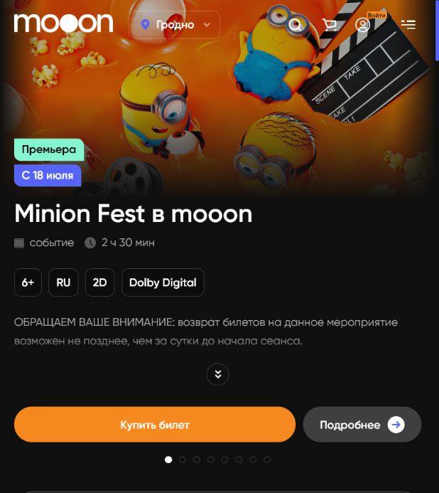
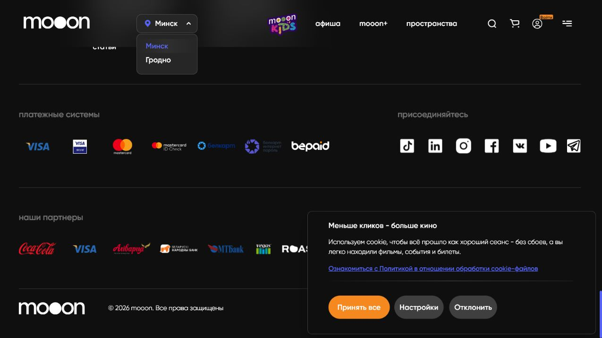
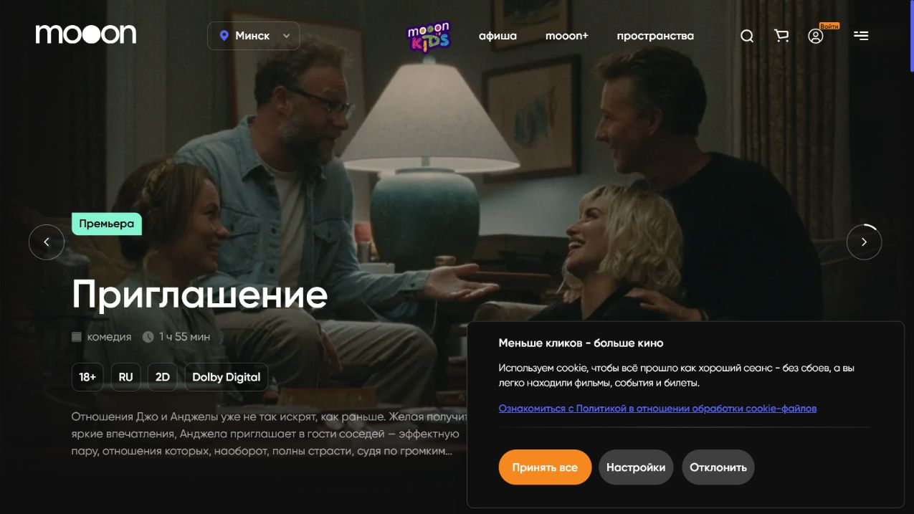
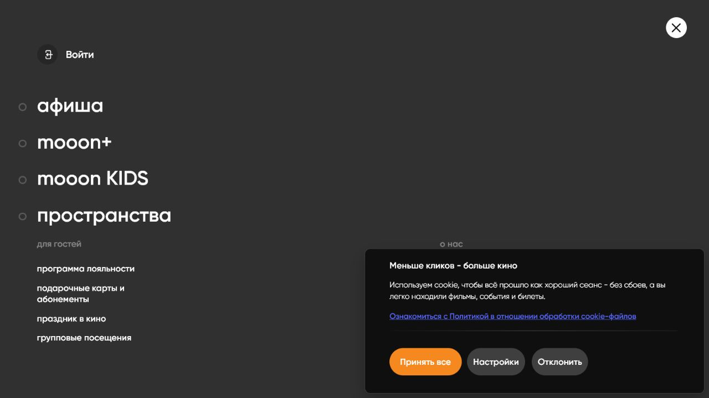

# Главная страница и глобальная навигация

Главная страница `mooon.by` — входная точка сайта. Она показывает витрину выбранного города и даёт переходы к афише, mooon+, кинопространствам, поиску, корзине, входу и сервисным страницам.

## Шапка сайта

В верхней части страницы находятся постоянные элементы навигации:

- логотип `mooon` — переход на главную страницу;
- селектор города — выбор `Минск` или `Гродно`;
- основные разделы `афиша`, `mooon+`, `пространства`;
- ссылка на `mooon KIDS`;
- иконка поиска;
- иконка корзины;
- кнопка входа;
- меню с дополнительными разделами.

Селектор города влияет на афишу, расписание и доступные площадки. Перед просмотром сеансов важно смотреть, какой город выбран в шапке.

## Основное содержимое главной

Главная страница состоит из промо- и навигационных блоков:

- крупный баннер события или подборки;
- карточки фильмов и событий;
- быстрый переход к афише;
- тематические фильтры `Все`, `Премьеры`, `mooon+`, `Детям`, `Эксклюзивно`;
- блок mooon+;
- новости и акции;
- блок про кинопространства.

Содержимое главной меняется в зависимости от города, текущей афиши, промо-кампаний и редакционных блоков сайта. Главная не заменяет полную афишу: для выбора даты, сеанса и покупки билета используется раздел `афиша`.

## Cookie-плашка

При первом открытии сайта может появиться плашка согласия на cookie.

На плашке есть:

- короткое объяснение использования cookie;
- ссылка на политику обработки cookie-файлов;
- кнопка `Принять все`;
- кнопка `Настройки`;
- кнопка `Отклонить`.

## Меню

Меню открывается иконкой с тремя линиями в правой части шапки.

В меню собраны:

- основные разделы `афиша`, `mooon+`, `mooon KIDS`, `пространства`;
- сервисы для гостей: программа лояльности, подарочные карты и абонементы, праздник в кино, групповые посещения;
- корпоративные разделы: сотрудничество, аренда залов, карьера, контакты;
- поиск по сайту.

## Поиск

Поиск открывается через иконку лупы в шапке. В поле поиска сайт предлагает ввести название события или другой запрос. Результаты относятся к материалам сайта и афише.

Отдельно нужно проверить, какие именно типы материалов индексируются поиском и как выглядит пустой результат. Этот вопрос вынесен в gaps.

## Корзина

Иконка корзины ведёт к текущей корзине покупки. Корзина наполняется после выбора места в сценарии покупки билета. Если билет не выбран, корзина не является основным стартовым экраном покупки.

## Футер

Футер повторяет основные разделы и содержит постоянные справочные ссылки:

- `афиша`: сейчас в кино, скоро, mooon+, детям;
- `для гостей`: лояльность, подарочные карты и абонементы, праздник в кино, групповые посещения, новости и статьи;
- `пространства`: страницы отдельных кинопространств;
- `о нас`: сотрудничество, аренда залов, карьера, контакты;
- `полезная информация`: документы, FAQ, скачивание билета и настройки Cookie.

В футере также находятся ссылки на социальные сети, платёжные системы, партнёров, пользовательские соглашения и политику конфиденциальности.

## Основные переходы с главной

| Элемент | Куда ведёт |
| --- | --- |
| `афиша` | список фильмов и событий выбранного города |
| `mooon+` | раздел специальных событий и направлений |
| `пространства` | список кинопространств, адреса и описания площадок |
| `mooon KIDS` | отдельный детский сайт |
| поиск | поиск по сайту и афише |
| корзина | текущая корзина покупки |
| вход | сценарий авторизации и личного кабинета |
| меню | расширенная карта разделов сайта |

## Связанные страницы

- [Сайт mooon.by](../Сайт%20mooon.by.md)
- [Карта разделов сайта](Карта%20разделов%20сайта.md)
- [Афиша и покупка билета](Афиша%20и%20покупка%20билета.md)
- [Афиша на mooon.by](../Афиша%20и%20витрина.md)
- [Сортировка афиши](../Афиша%20и%20витрина/Сортировка%20афиши.md)

