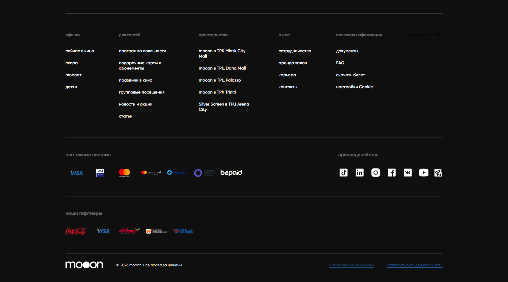

# Сервисные страницы и футер

Футер `mooon.by` — постоянная карта справочных, сервисных, юридических и внешних ссылок сайта. Эта страница не дублирует все материалы футера, а показывает, куда ведёт каждая группа ссылок и что нужно переносить в рабочие статьи базы знаний.

## Карта футера

| Группа | Ссылки | Как обработано |
| --- | --- | --- |
| `афиша` | сейчас в кино, скоро, mooon+, детям | Канонический сценарий находится в [Афиша и покупка билета](Афиша%20и%20покупка%20билета.md). Футер даёт быстрые входы в разные подборки афиши. |
| `для гостей` | программа лояльности, подарочные карты и абонементы, праздник в кино, групповые посещения, новости и акции, статьи | Лояльность, подарочные продукты и групповые заявки описаны как сервисные страницы. Денежные и договорные правила вынесены в отдельные страницы и вопросы. |
| `пространства` | Minsk City Mall, Dana Mall, Palazzo, Triniti, Arena City | Подробности по площадкам, залам, парковке и доступной среде собраны в [mooon+ и пространства](mooon+%20и%20пространства.md). |
| `о нас` | сотрудничество, аренда залов, карьера, контакты | Это внешние страницы без входа в личный кабинет. В базе фиксируются назначение, формы и общие контакты; персональные контакты менеджеров не переносятся без подтверждения. |
| `полезная информация` | документы, FAQ, скачать билет, настройки Cookie | FAQ разнесён в [FAQ и справочные сценарии](FAQ%20и%20справочные%20сценарии.md), возвраты — в [Возврат билетов](../Продажа%20билетов/Возврат%20билетов.md), восстановление билета — в сценарий покупки. |

## Решения по footer-страницам

| Страница | Решение | Что полезно для сотрудников |
| --- | --- | --- |
| `сейчас в кино`, `скоро`, `mooon+`, `детям` | Добавлять через каноническую страницу афиши | Быстрые входы в подборки, фильтры, карточки событий, покупку билета. |
| `программа лояльности` | Добавлять как справочный источник, финансовые правила сверять отдельно | Участие, вход, уровни, бонусы, QR-код на кассе, правила списания и сгорания бонусов. |
| `подарочные карты и абонементы` | Добавлять в раздел сертификатов и сервисных страниц | Покупка электронной или пластиковой карты, абонемент, корпоративный сценарий, проверка баланса. |
| `праздник в кино` | Оставить как внешний детский сценарий и gap по канонической ссылке | Переход на детский сайт для праздников; нужна проверка связи с FAQ-ссылкой на другой домен. |
| `групповые посещения` | Добавлять как заявку и условия страницы | Группы школьников, форма заявки, возрастное предупреждение, выкуп билетов после подтверждения. |
| `новости и акции` | Использовать как радар тем, не как регламент | Акции, изменения, сезонные материалы, темы бонусов, групп, абонементов и возвратов. |
| `статьи` | Использовать как справочные объяснения и идеи для обогащения | Материалы про афишу, опоздание, промокоды, возвраты, залы, доступность, аренду и подарки. |
| `пространства` | Добавлять в статью о площадках | Адреса, залы, форматы, парковка, доступная среда, контакты и режим работы. |
| `сотрудничество` | Описывать назначение и форму, не копировать персональные контакты | Рекламные возможности, заявки, требования к материалам, выбор кинопространств. |
| `аренда залов` | Описывать как внешний B2B/B2C-сценарий заявки | Аренда кинозалов, вкладки городов, типы мероприятий, форма и согласие на обработку данных. |
| `карьера` | Оставить как справочную внешнюю страницу | Вакансии, переходы на rabota.by и формы отклика. |
| `контакты` | Добавлять общие контакты и адреса | Единый номер, общий email, график call-центра, адреса и режим работы площадок. |
| `документы` | Использовать как юридический источник | Правила посещения, возврата, мест и возрастных категорий, персональные данные, договоры и оферты. |
| `FAQ` | Разнести по рабочим статьям | Билет не пришёл, оплата, возврат, промокод, подарочные карты, парковка, возрастные ограничения, обмен и сроки поступления денег. |
| `скачать билет` | Добавлять в сценарий покупки | Восстановление билета по номеру заказа и email. |
| `настройки Cookie` | Описывать только в контексте cookie | Управление cookie-плашкой и настройками сайта. |

## Программа лояльности

Страница `программа лояльности` описывает бонусную механику сайта и связанные действия пользователя.

На странице есть:

- описание участия в программе;
- уровни `5%` и `10%`;
- кнопки `Присоединиться` и `Войти`;
- блок дополнительных лояльностей;
- FAQ по начислению, списанию, уровню, сроку действия бонусов и ограничениям;
- ссылка на правила программы лояльности;
- контакт поддержки лояльности.

Лояльность связана с бонусами, скидками и личным кабинетом. Внутренним сотрудникам важно знать, где находится страница, где пользователь входит в программу и где на шаге оплаты появляются бонусы. Правила начисления, списания, ограничения по товарам и сроки действия относятся к правилам программы.

## Подарочные карты и абонементы

Страница `подарочные карты и абонементы` относится к подарочным продуктам сайта.

На странице есть:

- переходы к электронной карте, пластиковой карте, абонементу и корпоративному сценарию;
- блок `У вас уже есть подарочная карта или абонемент?`;
- действие `Узнать баланс`.

Условия покупки, применения, срока действия и возврата подарочных карт относятся к официальным правилам сайта и документам. В базе знаний фиксируются расположение страницы и действия, которые она даёт пользователю.

## Групповые посещения

Страница `групповые посещения` описывает условия и заявку для организованного визита группы.

На странице есть:

- описание предложения для школьных групп;
- форма заявки;
- поля `Город`, `Кинопространство`, `Имя и фамилия контактного лица`, `Электронная почта`, `Телефонный номер`, `Количество учащихся`, `Количество сопровождающих`, `Фильм`, `Дополнительные комментарии и пожелания`;
- предупреждение о возрастной категории фильма;
- текст о выкупе билетов после подтверждения брони;
- кнопка `Оставить заявку`;
- ссылка на соглашение об использовании персональных данных;
- блок контакта менеджера и графика связи.

Форма запрашивает персональные данные контактного лица. Персональные контакты сотрудников лучше проверять на самой странице, потому что они могут меняться.

## Праздник в кино

Ссылка `праздник в кино` ведёт на внешний детский сайт `mooonkids.by/holiday/`. Это отдельный сценарий для детских мероприятий. В футере `mooon.by` ссылка используется как переход из общего сайта в детское направление.

## Новости и акции

Страница `новости и акции` показывает редакционные карточки сети.

На странице есть:

- заголовок `новости и акции`;
- переключатели `Новости` и `Акции`;
- карточки с типом материала, датой, названием, кратким описанием и действием `Читать`.

В карточках встречаются темы оплат, возвратов, бонусов, абонементов, групповых посещений, детских праздников и партнёрских скидок. Такие материалы полезны как сигнал, что тема появилась или изменилась, но правила денег и обязательств нужно сверять по документам, FAQ или внутреннему регламенту.

## Статьи

Страница `статьи` содержит информационные материалы для гостей.

На странице есть карточки с датой, названием, кратким описанием и действием `Читать`. Темы охватывают афишу, опоздание на сеанс, абонементы, возврат билета бонусами, промокоды, детские сценарии, залы, доступную среду, аренду, подарочные карты, еду и события.

Статьи помогают понять, какие темы сайт объясняет гостям. Они подходят для обогащения справочных страниц: опоздание, выбор зала, доступная среда, аренда, подарки, детские сценарии, промокод и возврат. Для денег, возвратов, промокодов, подарочных карт и персональных данных приоритет имеют FAQ и документы.

## FAQ

Страница `FAQ` содержит ответы на частые вопросы сайта.

На странице есть темы:

- парковка;
- не пришёл оплаченный билет;
- проблемы с оплатой;
- возврат билета;
- промокод;
- подарочная карта;
- детские праздники;
- возрастные ограничения;
- залы;
- бронирование и перенос мест или сеансов;
- сроки поступления денег после возврата.

FAQ используется как справочный раздел для гостевых сценариев. Его темы разнесены в отдельную карту: [FAQ и справочные сценарии](FAQ%20и%20справочные%20сценарии.md). Возвраты вынесены отдельно: [Возврат билетов](../Продажа%20билетов/Возврат%20билетов.md).

## Скачать билет

Страница `скачать билет` предназначена для восстановления билета.

Форма запрашивает:

- номер заказа;
- email, на который должен был прийти билет.

Без этих данных сайт не может найти билет через эту форму.

## Документы

Раздел `документы` содержит соглашения, правила и политики сайта.

К этому разделу относятся юридические условия, правила посещения, возвраты, пользовательские соглашения, оферты и обработка данных. Для базы знаний это не инструкция, а точка сверки: если вопрос затрагивает деньги, возврат, подарочную карту, абонемент, персональные данные или договор, нужно опираться на актуальный документ.

## Cookie-настройки

Ссылка `настройки Cookie` открывает управление cookie сайта. Изображение ниже относится только к описанию cookie-плашки.

## Пространства

Группа `пространства` ведёт на страницы отдельных площадок:

- `mooon в ТРК Minsk City Mall`;
- `mooon в ТРЦ Dana Mall`;
- `mooon в ТРЦ Palazzo`;
- `mooon в ТРК Triniti`;
- `Silver Screen в ТРЦ Arena City`.

Эти ссылки нужны для перехода к адресу, описанию площадки, залам и форматам конкретного кинопространства.

## О нас и внешние страницы

Группа `о нас` содержит внешние страницы без входа в личный кабинет:

| Ссылка | Домен | Что есть на странице |
| --- | --- | --- |
| `сотрудничество` | `info.mooon.by` | рекламные возможности, формы заявки, требования к материалам, выбор кинопространства |
| `аренда залов` | `space.silverscreen.by` | аренда кинозала в Минске и Гродно, вкладки городов, форма заявки, согласие на обработку персональных данных |
| `карьера` | `info.mooon.by` | описание работы в сети, переход к вакансиям и внешним формам отклика |
| `контакты` | `info.mooon.by` | единый номер, общие email, адреса и режим работы кинопространств |

На внешних страницах есть формы, которые запрашивают контактные данные. В базе знаний достаточно описывать назначение страницы, поля формы и официальный переход.

## Контакты

Страница контактов закрывает базовый справочный сценарий: куда обращаться по общим вопросам, B2B-продажам, маркетингу, лояльности, работе и аренде.

Что полезно фиксировать:

- единый номер сети;
- общий email;
- график обработки звонков и писем;
- адреса и режим работы площадок;
- юридический блок компании.

Персональные контакты сотрудников с внешних страниц не переносятся в рабочие статьи без подтверждения владельца процесса.

## Соцсети, партнёры и платёжные системы

В футере есть блок `Присоединяйтесь` со ссылками на внешние каналы:

- TikTok;
- LinkedIn;
- Instagram;
- Facebook;
- VK;
- YouTube;
- Telegram.

Также отображаются иконки платёжных систем и партнёров. У части партнёрских иконок нет текстового названия в доступном HTML, поэтому они фиксируются как визуальный блок футера.

## Деньги, возвраты и персональные данные

Темы оплаты, возвратов, промокодов, сертификатов, подарочных карт, абонементов, бонусов, сроков поступления денег и персональных данных нельзя дополнять по памяти. Для них фиксируются страницы, поля, переходы и действия, а точные правила берутся из актуального FAQ, документов сайта или подтверждённого регламента.

## Связанные страницы

- [Сайт mooon.by](../Сайт%20mooon.by.md)
- [Карта разделов сайта](Карта%20разделов%20сайта.md)
- [FAQ и справочные сценарии](FAQ%20и%20справочные%20сценарии.md)
- [Афиша и покупка билета](Афиша%20и%20покупка%20билета.md)
- [Возврат билетов](../Продажа%20билетов/Возврат%20билетов.md)
