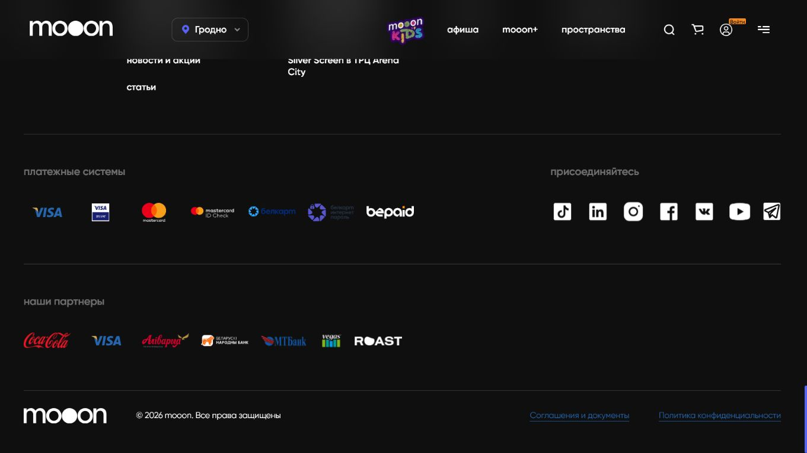
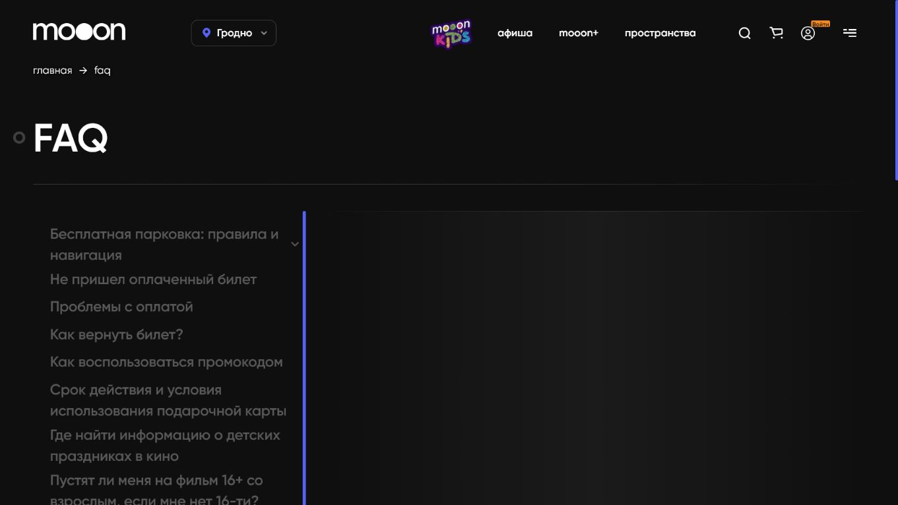
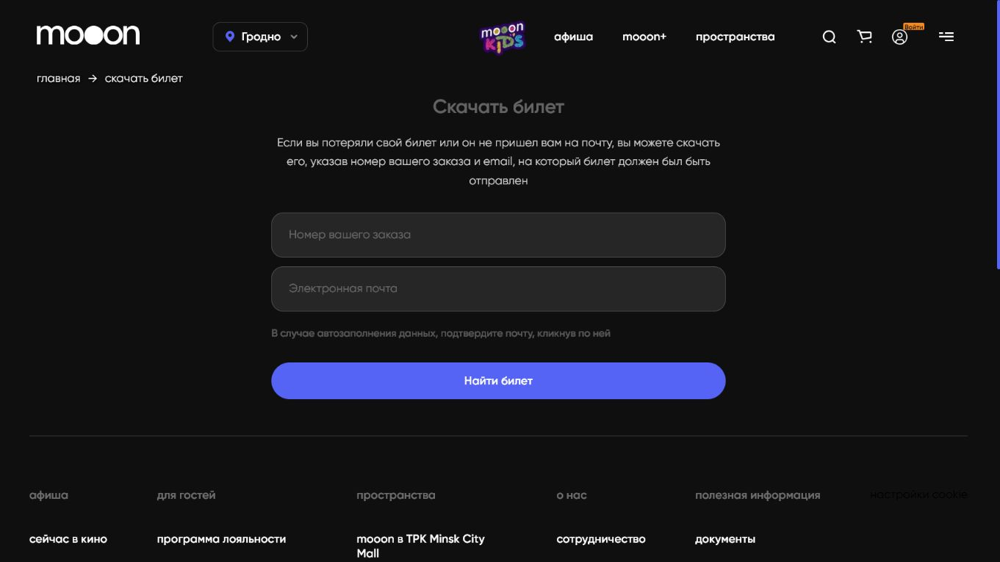
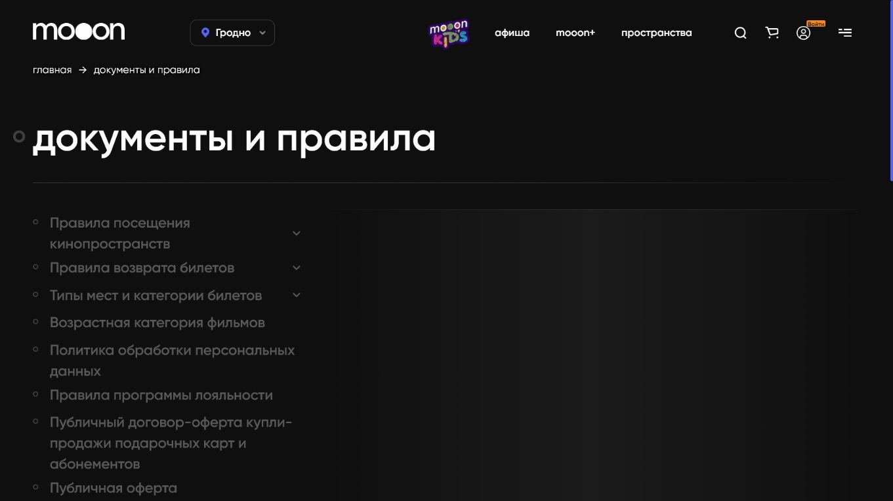

# Сервисные страницы и футер

Футер `mooon.by` содержит постоянную карту справочных, сервисных, юридических и внешних ссылок сайта.

## Группы футера

| Группа | Что внутри |
| --- | --- |
| `афиша` | сейчас в кино, скоро, mooon+, детям |
| `для гостей` | лояльность, подарочные карты и абонементы, праздник в кино, групповые посещения, новости и статьи |
| `пространства` | страницы отдельных кинопространств |
| `о нас` | сотрудничество, аренда залов, карьера, контакты |
| `полезная информация` | документы, FAQ, скачать билет, настройки Cookie |

## Программа лояльности

Страница `программа лояльности` описывает бонусную механику сайта и связанные действия пользователя.

На странице представлены условия участия, преимущества и переходы, связанные с регистрацией или входом. Детальные правила начислений и списаний нужно сверять с актуальным текстом сайта.

## Подарочные карты и абонементы

Страница `подарочные карты и абонементы` относится к подарочным продуктам сайта.

На странице описываются подарочные карты, абонементы и действия, связанные с их покупкой или применением. Номиналы, ограничения и денежные правила не должны пересказываться по памяти.

## Групповые посещения

Страница `групповые посещения` описывает условия и заявку для организованного визита группы.

На странице расположены описание формата, условия и элементы для отправки заявки.

## FAQ

Страница `FAQ` содержит ответы на частые вопросы сайта.

На странице есть темы:

- парковка;
- не пришёл оплаченный билет;
- проблемы с оплатой;
- возврат билета;
- промокод;
- подарочная карта;
- детские праздники;
- возрастные ограничения;
- залы;
- бронирование и перенос мест или сеансов;
- сроки поступления денег после возврата.

## Скачать билет

Страница `скачать билет` предназначена для восстановления билета.

Форма запрашивает:

- номер заказа;
- email, на который должен был прийти билет.

Без этих данных сайт не может найти билет через эту форму.

## Документы

Раздел `документы` содержит соглашения, правила и политики сайта.

К этому разделу относятся юридические условия, правила посещения, возвраты, пользовательские соглашения и обработка данных. Точные правила нужно брать из актуальных документов сайта.

## Деньги, возвраты и персональные данные

Темы оплаты, возвратов, промокодов, сертификатов, подарочных карт, НДС, сроков поступления денег и персональных данных относятся к зонам повышенного риска. В этой wiki фиксируется расположение соответствующих страниц и элементов сайта, но не придумываются финансовые или юридические правила.

## Связанные страницы

- [Сайт mooon.by](../Сайт%20mooon.by.md)
- [Карта разделов сайта](Карта%20разделов%20сайта.md)
- [Афиша и покупка билета](Афиша%20и%20покупка%20билета.md)

