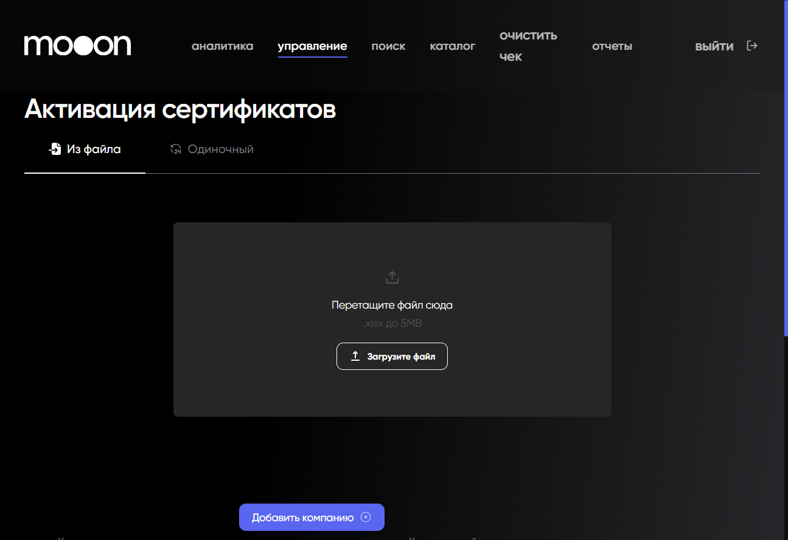

# Активация сертификатов через Portal

## Суть

Сертификаты активируются через форму в Portal. Для сертификатов Maverick в поле `Компании` обязательно выбирается ООО "Кино Маяк" — так эмитент корректно попадает в учёт.

Активацию не нужно делать вручную через Битрикс или в обход формы портала.

## Когда применяется

Когда нужно активировать один или несколько сертификатов из подготовленного Excel-файла.

## Где находится

Portal `https://portal.mooon.by`: `управление -> Активация сертификатов`.

По умолчанию используется вкладка `Из файла`.

## Что подготовить

Перед активацией нужен Excel-файл в формате `.xlsx`.

Файл должен соответствовать шаблону и содержать две колонки:

| Колонка | Что указать |
|---|---|
| `UN сертификата` | внутренний UN сертификата |
| `Номер сертификата` | 16-значный номер сертификата |

Номинал или категория сертификата определяется системой по данным сертификата. Поэтому в одном файле могут быть сертификаты разных номиналов.

## Порядок действий

1. Зайти в Portal.
2. Открыть `управление -> Активация сертификатов`.
3. Убедиться, что открыта вкладка `Из файла`.
4. Загрузить подготовленный Excel-файл.
5. В поле `Компании` выбрать ООО "Кино Маяк".
6. В поле `Комментарий` при необходимости указать, для кого и по чьей просьбе активируются сертификаты.
7. Проверить дату активации.
8. Нажать `Сохранить`.

На форме также видна кнопка `Добавить компанию`. Порядок добавления новой компании не используется без отдельного регламента.

## Одиночный сертификат

На вкладке `Одиночный` в начальном состоянии отображаются поле `Введите номер сертификата` и действия `Поиск` и `Сбросить`. Дальнейшие действия после поиска не подтверждены, поэтому вкладка не описывается как отдельный способ активации.

## Обязательные правила

- Файл должен быть в формате `.xlsx`.
- Файл должен соответствовать шаблону: `UN сертификата` и `Номер сертификата`.
- Номер сертификата должен состоять из 16 цифр.
- Для сертификатов Maverick в поле `Компании` нужно выбрать ООО "Кино Маяк".
- Перед сохранением нужно проверить загруженный файл, компанию и дату активации.
- Не добавлять новую компанию без подтверждённого регламента.
- Не использовать ручную активацию через Битрикс.
- Не активировать сертификаты в обход формы портала.

## Риски и контроль

- Сертификаты и учёт — зона повышенного риска.
- Если выбрать неправильную компанию, эмитент может некорректно попасть в учёт.
- Если загрузить файл не по шаблону, сертификаты могут не активироваться корректно.
- Если ошибиться в номере сертификата, активация может пройти не для того сертификата или завершиться ошибкой.
- Обход формы портала нарушает корректный учёт сертификатов.

## Частые ошибки

- Загружают файл не в формате `.xlsx`.
- Используют файл не по шаблону.
- Указывают номер сертификата не из 16 цифр.
- Не выбирают ООО "Кино Маяк" в поле `Компании`.
- Не проверяют дату активации перед сохранением.
- Пытаются активировать сертификаты через Битрикс или другим обходным способом.

## Связанные страницы

- [Сертификаты](../Сертификаты.md)
- [Портал](../Портал.md)
