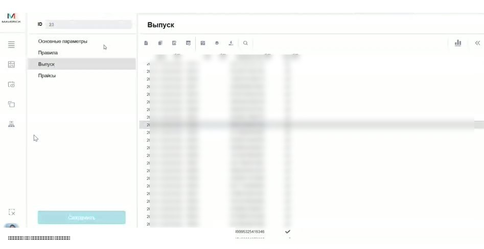
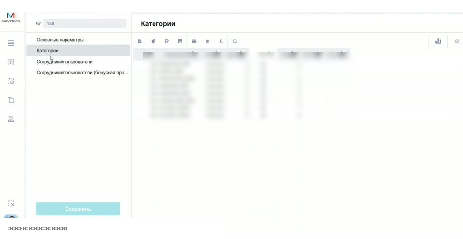
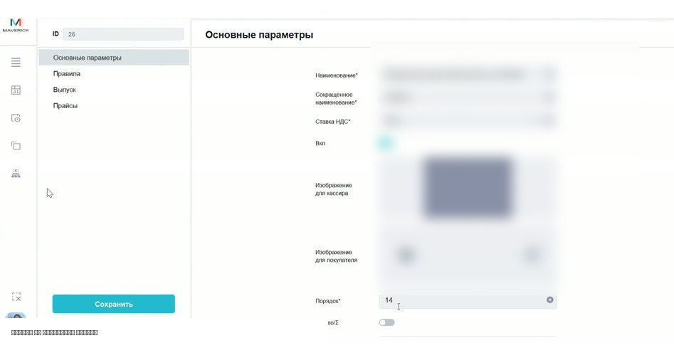
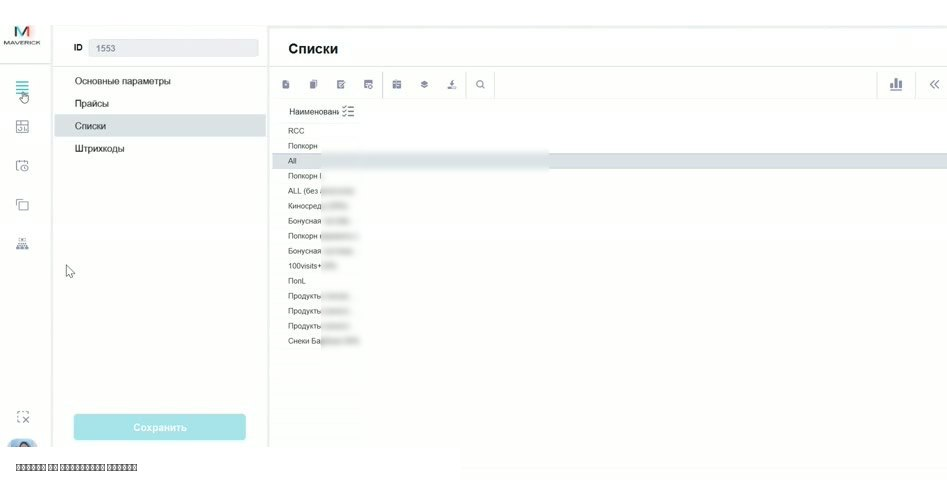
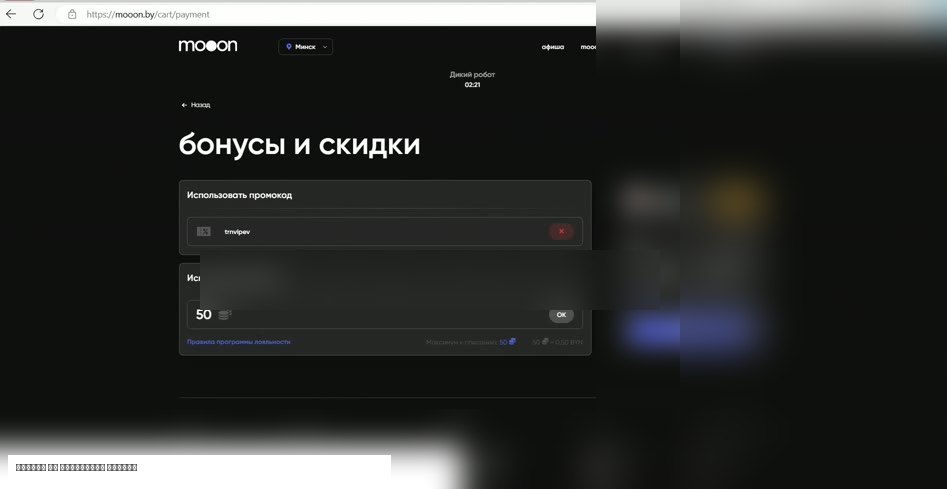

# Проверка и разбор проблем с сертификатами

Эта инструкция помогает быстро понять, почему сертификат не применяется, почему остаток не совпадает или почему касса не даёт оплатить конкретный товар, комбо или билет.

<strong>Для кого</strong>
Поддержка, администратор, кассир.

<strong>Когда применяется</strong>
Клиент или касса сообщает, что сертификат не работает, не виден остаток или не проходит оплата.

<strong>Что получится</strong>
Понятно, где проблема: в номере, остатке, выпуске, списках товаров/комбо или способе применения.

## Быстрый алгоритм

1. Попроси номер сертификата или фото карты, если номер не очевиден.
2. Проверь сертификат по номеру в системе.
3. Сравни остаток в системе и то, что видит касса или клиент.
4. Если остаток есть, но оплатить нельзя — проверь, что товар, комбо или билет разрешён для этого сертификата.
5. Если сертификат вводят на сайте — проверь, в какое поле его вводят: промокод и сертификат/бонусы обрабатываются по-разному.
6. Если по данным видно списание или продажу — проверь связанные операции.

!!! warning "Важно"
    Сертификаты связаны с деньгами и обязательствами перед клиентом. Не меняй выпуск, категории, списки товаров или промокоды без подтверждённого регламента и ответственного владельца процесса.

## Что проверить в системе

### Выпуск сертификата

В карточке категории сертификата открой раздел **Выпуск**. Там можно искать сертификат по номеру и смотреть базовые признаки выпуска.

Проверь:

- есть ли сертификат в списке;
- совпадает ли кодовый номер;
- есть ли UN;
- включён ли сертификат;
- какая дата выпуска указана.

Если сертификата нет в выпуске, его нельзя считать активным только по фото или словам клиента.

### Остаток и операции

Если касса показывает один остаток, а сайт или система — другой, сначала проверь сам сертификат в системе.

Что смотреть:

- текущий остаток;
- продажи;
- оплаты;
- списания;
- отмены операций.

Если остаток в системе полный, а касса говорит, что денег не хватает, уточни, что именно пробивают: билет, товар, комбо или другую позицию.

### Категория сертификата

Категория помогает понять правила сертификата: тип, номинал, срок действия, доступные списки и связанные признаки.

В карточке категории проверяй основные параметры и связанные разделы.

## Если сертификат не применяется

### Не пробивается товар или комбо

Сертификат может быть привязан не ко всем товарам и комбо. Если остаток есть, но конкретная позиция не проходит, вероятная причина — позиция не добавлена в разрешённый список.

Проверка:

1. Открой карточку товара или комбо.
2. Перейди в раздел **Списки**.
3. Проверь, есть ли нужный список, связанный с сертификатами.
4. Если позиции нет в нужном списке — передай задачу ответственному за товары/комбо.

!!! note "Важно"
    Если список товаров или комбо ведёт другой сотрудник, поддержка не должна молча менять настройки. Зафиксируй проблему и передай владельцу справочника товаров/комбо.

### На сайте ввели код, но он не сработал

На сайте сертификат проверяется в блоке **Бонусы и скидки**. Там важно не путать поля:

- поле для промокода;
- поле для бонусов/сертификата.

Если клиент вводит номер не в то поле, система может не применить сертификат, хотя сам сертификат существует.

### Вопрос оказался про промокод

Промокод и сертификат — не одно и то же. Если обращение звучит как «ввели код, а он не сработал», сначала выясни, что именно вводили:

- номер сертификата;
- промокод;
- UN;
- короткий номер с карты;
- длинный кодовый номер.

Для промокодов проверяй отдельный список промокодов.

## Что запросить и когда передавать дальше

Чтобы не гадать, попроси:

- фото сертификата или точный номер;
- что именно пытались оплатить;
- где применяли сертификат: касса или сайт;
- какой остаток видит касса/сайт;
- скрин ошибки или сообщение кассира;
- если проблема с товаром — название товара или комбо.

Передавай ответственному владельцу процесса, если:

- нужно менять списки товаров или комбо;
- нужно менять категорию сертификата;
- есть расхождение по деньгам, которое не объясняется операциями;
- требуется подтвердить финансовое или учётное правило;
- непонятно, был ли сертификат уже использован или отменён.

## Частые причины проблем

| Симптом | Что проверить первым |
|---|---|
| Сертификат не находится | Правильный ли номер ввели, есть ли выпуск |
| Остаток не совпадает | Выпуск, продажи, оплаты, списания, отмены |
| Денег хватает, но товар не проходит | Привязан ли товар/комбо к разрешённому списку |
| На сайте не применяется код | В то ли поле ввели: промокод или сертификат/бонусы |
| Касса видит одну сумму, сайт другую | Проверить сертификат в системе и уточнить, что именно пробивают |

## Связанные страницы

- [Сертификаты](../Сертификаты.md)
- [Активация сертификатов через Portal](Активация%20сертификатов%20через%20Portal.md)
- [Билеты и касса](../Продажа%20билетов.md)
- [Касса Seller Web](../Seller.md)
