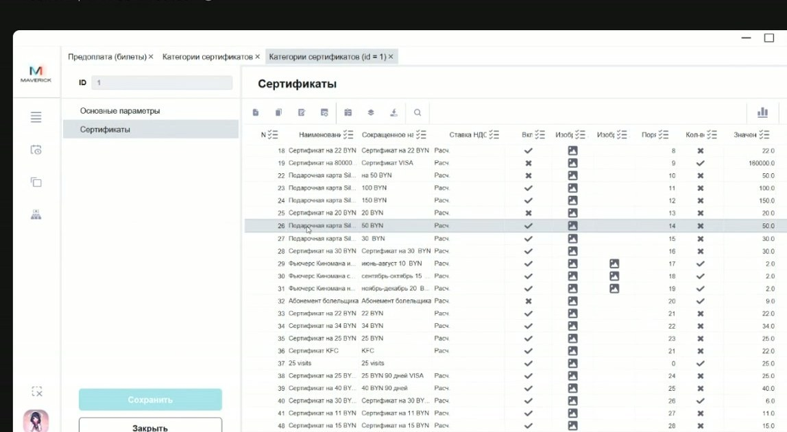
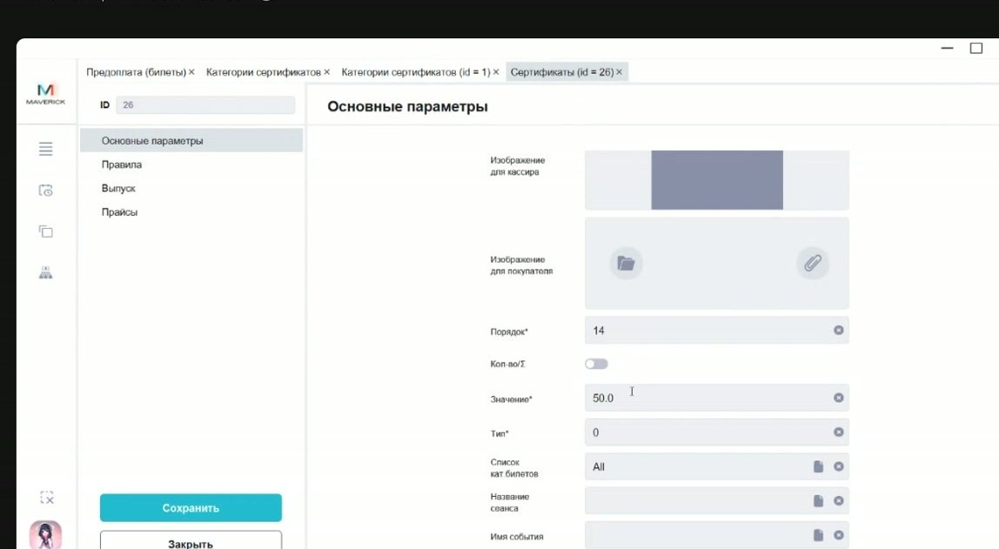
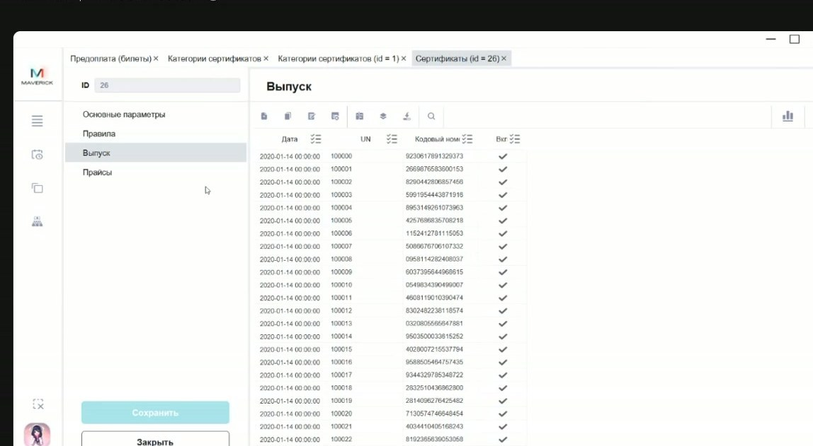
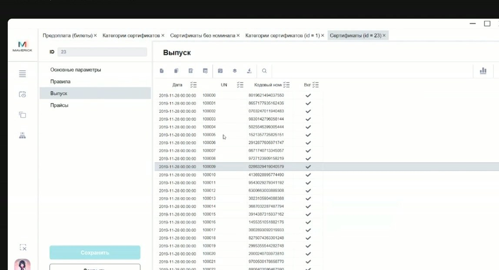
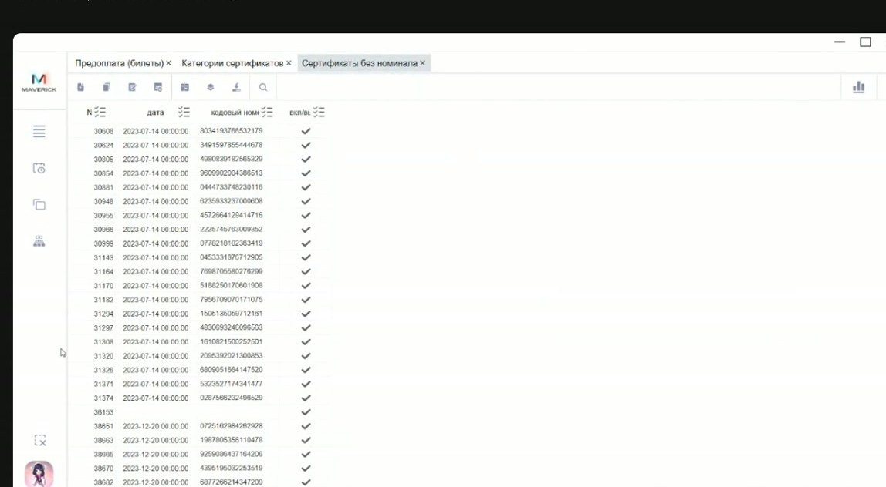
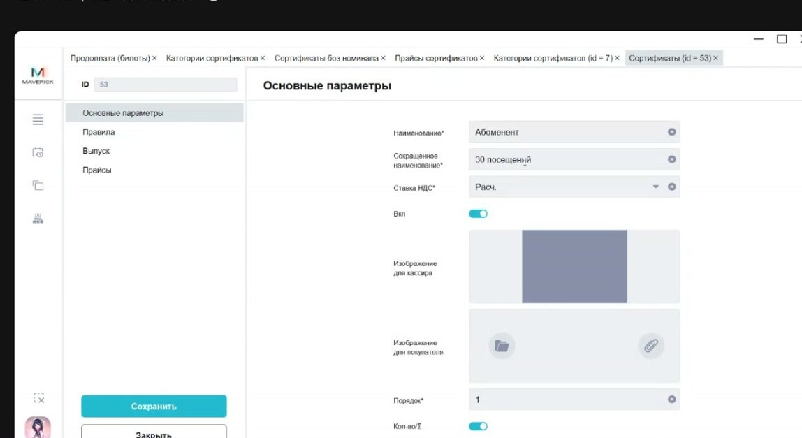
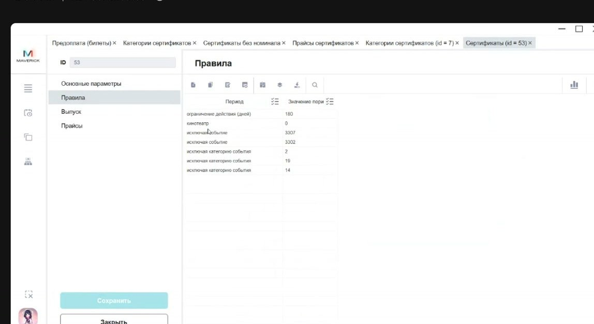

# Проверка и разбор проблем с сертификатами в Manager

Эта инструкция помогает проверить сертификат в Manager и понять, почему он не применяется, почему не сходится остаток или почему сертификатом нельзя оплатить конкретный билет, товар или комбо.

<div class="kb-meta" markdown>
<div markdown>
<strong>Для кого</strong>
Поддержка, администратор, кассир, менеджер настройки.
</div>
<div markdown>
<strong>Когда применяется</strong>
Клиент или касса сообщает, что сертификат не работает, не виден остаток, не проходит оплата или непонятно, был ли сертификат активирован.
</div>
<div markdown>
<strong>Что получится</strong>
Понятно, где проблема: в выпуске, категории, активности, номере, остатке, списках разрешённых товаров/комбо или правилах применения.
</div>
</div>

## Что проверить первым

1. Уточни, что именно дал клиент: 16-значный кодовый номер, короткий UN, фото пластика, номер заказа или другой код.
2. Определи тип обращения: продажа сертификата, применение сертификата, остаток, абонемент, промокод или предоплата.
3. Если известна категория сертификата, открой её в Manager и проверь выпуск.
4. Если категория неизвестна и есть только 16-значный номер, не додумывай путь поиска: этот сценарий требует отдельного подтверждённого алгоритма.
5. Если нужно менять категорию, правила, списки или остатки — не делай это без регламента.

!!! warning "Деньги и обязательства"
    Сертификаты связаны с деньгами и обязательствами перед клиентом. Не меняй выпуск, категории, правила, списки товаров/комбо или остатки без подтверждённого регламента.

## Где смотреть сертификаты

Путь:

```text
Manager → Сертификаты → Категории сертификатов
```



Категории работают как папки. Внутри категории находятся конкретные виды сертификатов: подарочные карты, электронные сертификаты, абонементы и другие варианты.

## Проверка карточки сертификата

В карточке сертификата проверь основные параметры:

| Поле / признак | Что означает |
| --- | --- |
| Наименование | Название сертификата или подарочной карты. |
| Сокращённое наименование | Короткое название для интерфейсов. |
| Ставка НДС | Налоговая ставка. Проверяется по правилу клиента. |
| Вкл | Если сертификат выключен, гость не сможет им воспользоваться. |
| Порядок | Позиция сертификата внутри своей категории. |
| Сумовой / количественный | Сумовой списывает деньги; количественный/абонемент списывает посещения. |
| Список категорий билетов | На какие категории мест/билетов действует сертификат. |
| Список продуктов / комбо | На какие товары или комбо действует сертификат. |



Если остаток есть, но конкретный товар, комбо или билет не проходит, сначала проверь списки, к которым привязан сертификат.

## Выпуск сертификатов

Во вкладке **Выпуск** находятся номера сертификатов внутри выбранной категории.



Проверяй:

- есть ли номер в выпуске;
- включён ли сертификат;
- какой указан кодовый номер;
- есть ли короткий UN;
- относится ли номер к нужной категории.

Сгенерированный номер сам по себе ещё не означает, что сертификат продан и активен. Номер может быть подготовлен для будущей реализации.

## Кодовый номер и UN

UN сертификата — короткий номер внутри категории. У сертификата есть два разных идентификатора:

| Идентификатор | Что это |
| --- | --- |
| Кодовый номер | 16-значный номер сертификата. Обычно печатается на пластике или используется как длинный код. |
| UN | Короткий номер внутри категории сертификатов. Присваивается по порядку при активации/продаже. |



Важное правило: UN уникален **внутри категории сертификата**. В разных категориях один и тот же UN может повториться. Уникальной считается связка:

```text
категория сертификата + UN
```

Кодовый номер — длинный случайный номер. Он нужен для самого сертификата, но при обмене с другими системами может быть неудобен: Excel или внешняя система могут интерпретировать длинный номер как число или строку и исказить ведущие нули. Поэтому короткий UN удобнее для сопоставления между системами, но только вместе с категорией.

## Сертификаты без номинала

Сертификат без номинала — это заготовка номера, которую можно напечатать на пластике до продажи.



Порядок такой:

1. В Manager создаются номера сертификатов без номинала.
2. Кодовые номера передаются для печати на пластике.
3. На кассе кассир выбирает номинал, который продаётся.
4. При продаже кодовый номер привязывается к выбранному номиналу.
5. В этот момент сертификат получает короткий UN и становится активированным через продажу.

Обычный правильный путь активации сертификата — продажа на кассе. Служебная или массовая активация через Portal допускается только по отдельному регламенту.

## Эмитент сертификата

При продаже сертификата в данных создаётся продажа с суммой и компанией, которая продала сертификат. Эта компания выступает эмитентом для учёта.

Эмитент важен для бухгалтерии: по нему потом корректно отражают списание и обязательства по сертификату.

Если сертификат был заведён, но не продан, организация продажи может быть пустой. Это не нужно трактовать как ошибку без проверки статуса продажи/активации.

## Абонементы и количественные сертификаты

Абонемент — это количественный сертификат. Он списывает не сумму билета, а количество посещений.



Пример: абонемент на 30 посещений.

- Один обычный билет списывает одно посещение.
- Диван на два места списывает два посещения.
- Если абонемент должен действовать только на определённые категории мест, это задаётся через список категорий билетов.
- Если абонемент действует только на билеты, списки продуктов и комбо могут быть пустыми.



Дополнительные правила могут ограничивать применение абонемента по категории события, конкретному событию, залу или другому условию. Если правило ссылается на внутренний ID справочника, не угадывай ID — проверь его в соответствующем справочнике.

## Учёт абонемента при оплате

Для бухгалтерии передаётся сумма оплаты сертификатом. Для абонемента стоимость одного посещения рассчитывается из стоимости абонемента и количества посещений.

Пример:

```text
абонемент стоит 420 рублей
количество посещений: 30
стоимость одного посещения: 420 / 30 = 14 рублей
```

Если оплачивается диван на два места, будет списано два посещения и сумма будет рассчитана за два места.

Точные правила округления и НДС по абонементам нужно проверять отдельно, если есть расхождение в деньгах.

## Если сертификат не применяется

Проверь по порядку:

1. Сертификат есть в выпуске нужной категории.
2. Сертификат включён.
3. Сертификат был продан или активирован по регламенту.
4. Остаток или количество посещений не исчерпаны.
5. Билет, товар или комбо входят в разрешённый список.
6. Дополнительные правила не исключают выбранное событие, зал или категорию.
7. Клиент вводит код в правильное поле: сертификат и промокод — разные сущности.

## Что запросить у кассира или клиента

- фото сертификата или точный 16-значный кодовый номер;
- короткий UN, если он известен;
- что пытались оплатить: билет, товар, комбо;
- где применяли сертификат: касса, сайт, киоск;
- какой остаток или ошибку видит пользователь;
- объект, кассу и дату операции;
- скрин ошибки или карточки операции.

## Когда передавать дальше

Передавай ответственному владельцу процесса, если:

- нужно менять категорию сертификата;
- нужно менять правила применения;
- нужно менять списки товаров, комбо или категорий билетов;
- не сходится остаток или сумма списания;
- есть вопрос по эмитенту или бухгалтерскому учёту;
- есть только 16-значный номер, но неизвестно, в какой категории искать сертификат.

## Частые причины проблем

| Симптом | Что проверить первым |
| --- | --- |
| Сертификат не находится | Известна ли категория; есть ли номер во вкладке **Выпуск**. |
| Сертификат выключен | Признак **Вкл** в карточке. |
| Остаток есть, но товар не проходит | Список продуктов или комбо. |
| Билет не проходит | Список категорий билетов и дополнительные правила. |
| Абонемент списывает не ту величину | Количество мест и стоимость одного посещения. |
| В отчёте нет организации продажи | Был ли сертификат продан/активирован. |
| Клиент вводит код на сайте, но он не работает | Не перепутано ли поле сертификата с полем промокода. |

## Связанные страницы

- [Сертификаты](../Сертификаты.md)
- [Сертификаты в Manager](../Manager/Сертификаты%20в%20Manager.md)
- [Активация сертификатов через Portal](Активация%20сертификатов%20через%20Portal.md)
- [Базовая работа в Seller Web](../Seller/Базовая%20работа%20в%20Seller%20Web.md)
