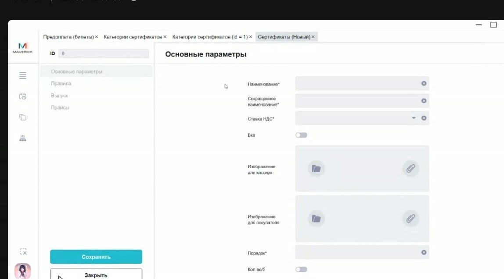
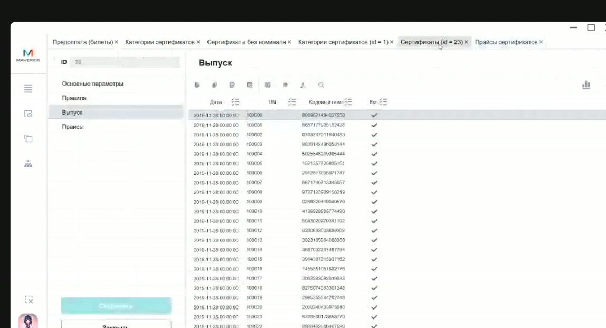

# Создание и выпуск сертификатов в Manager

Эта инструкция помогает понять, какие настройки нужны перед продажей сертификата: карточка сертификата, правила применения, прайс, выпуск номеров и заготовки без номинала для печати пластика.

<div class="kb-meta" markdown>
<div markdown>
<strong>Для кого</strong>
Менеджер настройки, поддержка, администратор, технический специалист.
</div>
<div markdown>
<strong>Когда применяется</strong>
Нужно подготовить новый номинал, электронную подарочную карту, абонемент или пластиковые заготовки сертификатов.
</div>
<div markdown>
<strong>Что получится</strong>
Сертификат настроен так, чтобы его можно было продать по нужному каналу и применить только по разрешённым правилам.
</div>
</div>

!!! warning "Деньги и обязательства"
    Сертификаты связаны с оплатой, остатками, НДС и обязательствами перед клиентом. Не создавай и не меняй правила, прайсы, выпуск или признаки активности без подтверждённого регламента.

## Где находится

Основной путь:

```text
Manager → Сертификаты → Категории сертификатов
```

Для пластиковых заготовок без номинала:

```text
Manager → Сертификаты → Сертификаты без номинала
```

## Перед созданием

До настройки нужно определить:

- к какой категории относится сертификат: подарочная карта, электронный сертификат, абонемент или другой вид;
- сертификат сумовой или количественный;
- номинал или количество посещений;
- где сертификат должен продаваться: касса, сайт или другой канал;
- на какие билеты, товары или комбо он должен действовать;
- нужны ли ограничения по событию, категории события, залу, объекту или периоду;
- какой прайс и цена должны использоваться для продажи.

## Создать карточку сертификата

1. Открой нужную категорию сертификатов.
2. Перейди на вкладку **Сертификаты**.
3. Нажми **+** для создания нового сертификата.
4. Заполни обязательные поля карточки:
   - категорию;
   - наименование;
   - сокращённое наименование;
   - ставку НДС;
   - признак активности;
   - порядок внутри категории;
   - тип: сумовой или количественный.
5. Сохрани карточку.



После сохранения карточки проверь вкладки с правилами, списками и прайсами. Сама карточка без правил продажи и выпуска номеров ещё не означает, что сертификат готов к работе.

## Настроить правила применения

Правила определяют, где и на что можно применить сертификат.

Проверь:

- список категорий билетов;
- список продуктов;
- список комбо;
- дополнительные условия по событию, категории события, залу, объекту или периоду;
- исключения, если сертификат не должен действовать на отдельные события или категории.



Если правило ссылается на внутренний ID справочника, не подставляй значение наугад. Открой соответствующий справочник и проверь ID там.

## Настроить продажу через прайс

Если сертификат должен продаваться на кассе или в другом канале, его нужно привязать к прайсу с ценой.

Проверь:

- выбран ли прайс нужного объекта или канала;
- указана ли цена продажи;
- включён ли сертификат;
- не конфликтуют ли правила применения с каналом продажи.

Если прайс не настроен, сертификат может существовать в Manager, но не появиться в продаже.

## Выпустить номера сертификатов

После настройки карточки выпусти номера, которые будут продаваться или активироваться.

Во вкладке **Выпуск** проверяй:

- количество выпущенных номеров;
- 16-значные кодовые номера;
- короткие UN;
- активность номера;
- принадлежность к нужной категории.


Выпуск номера сам по себе не равен продаже. Сертификат становится рабочим для клиента после продажи или после подтверждённой служебной активации.

## Сертификаты без номинала

Сертификаты без номинала используют как пластиковые заготовки. На этом этапе у номера ещё нет привязанного номинала.

Порядок:

1. Открой **Сертификаты без номинала**.
2. Нажми **+**.
3. Укажи нужное количество номеров.
4. Сохрани выпуск.
5. Передай 16-значные кодовые номера для печати на пластике.


У таких заготовок есть кодовый номер, но нет короткого UN и номинала до продажи. При продаже кассир выбирает нужный номинал, а система привязывает к нему кодовый номер.

## Проверка результата

После настройки должно быть так:

- карточка сертификата сохранена в правильной категории;
- сертификат включён, если его уже можно продавать или применять;
- правила применения соответствуют задаче;
- для продажи выбран прайс и цена;
- номера выпущены;
- для пластиковых заготовок подготовлены 16-значные кодовые номера;
- спорные финансовые или налоговые параметры подтверждены владельцем процесса.

## Частые ошибки

| Ошибка | Что проверить |
| --- | --- |
| Сертификат создан, но не продаётся | Есть ли прайс и цена для нужного объекта или канала. |
| Сертификат продаётся, но не применяется | Списки категорий билетов, товаров, комбо и дополнительные правила. |
| Пластиковая заготовка не имеет UN | Это нормально до продажи: UN появляется после продажи/активации. |
| Один UN встречается в разных местах | UN уникален внутри категории; проверяй связку `категория + UN`. |
| Нельзя понять, какое правило сработало | Проверь дополнительные условия и ID в связанных справочниках. |

## Связанные страницы

- [Сертификаты](../Сертификаты.md)
- [Проверка и разбор проблем с сертификатами](Проверка%20и%20разбор%20проблем%20с%20сертификатами.md)
- [Сертификаты в Manager](../Manager/Сертификаты%20в%20Manager.md)
- [Активация сертификатов через Portal](Активация%20сертификатов%20через%20Portal.md)
